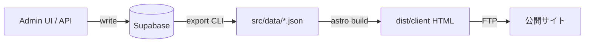

# CMS Kit Architecture（商品共通 CMS 層）

Phase 3-R 派生ドキュメント。`output/generated-astro` に散在する Admin/API 実装を、将来の **再利用可能 CMS Kit** として分離するための構成案。

---

## 1. 問題定義

現状:

```text
tools/static-to-astro/scripts/     ← 汎用 CLI（変換・seed・export・検証）
tools/static-to-astro/output/generated-astro/
  src/lib/admin-*.ts                 ← 手追加（generator 未統合）
  src/pages/admin/                   ← 手追加
  src/pages/api/admin/               ← 手追加（Node adapter 必須）
```

`convert-static-to-astro.mjs` を再実行すると **Admin 実装が上書き・消失** するリスクがある。

---

## 2. 目標アーキテクチャ

```text
tools/static-to-astro/
  templates/
    site-static/              # 公開 Astro（static output デフォルト）
    site-cms-admin/           # Admin pages + API routes（Node adapter）
    modules/
      schedule/               # event/schedule module
      discography/            # musician module
      featured-home/          # home featured limit
  kits/
    cms-core/                 # admin-auth, me.json, bootstrap 手順
  profiles/
    musician-gosaki.yaml      # 有効 module, limit, table mapping
```

生成フロー:

```text
静的 HTML fixture
  → convert-static-to-astro（site-static ベース）
  → --enable-cms musician-gosaki
       → merge site-cms-admin + modules/schedule + modules/discography
  → export-supabase-json（運用時）
  → build（profile に応じ static or hybrid）
```

---

## 3. CMS Kit レイヤー

### 3.1 cms-core（必ず汎用）

| コンポーネント | 由来 | 責務 |
| --- | --- | --- |
| `admin-auth.ts` | generated-astro | Bearer 検証, `requireAdminAuth`, `resolveAdminMe` |
| `/api/admin/me.json` | generated-astro | session / admin 判定 |
| env 契約 | `.env.example` | `SUPABASE_URL`, `SERVICE_ROLE`, `ANON`, admin credentials |
| verifier 群 | `scripts/verify-admin-api-auth.mjs` 等 | 回帰テスト |

**非スコープ（cms-core に入れない）:** Schedule/Discography のフィールド定義、サイト固有 CSS。

### 3.2 modules（サイト種別テンプレート）

#### schedule module（event/schedule）

- Tables: `schedule_months`, `schedules`
- Files: `admin-schedule-update.ts`, `ScheduleEditorMock.astro`, `ScheduleList.astro`, `HomeSchedule.astro`
- Config: `HOME_FEATURED_LIMIT`, allowed update fields
- Verifiers: schedule update / UI save / minimal loop（schedule 部分）

#### discography module（musician）

- Tables: `discography`, `discography_tracks`
- Files: `admin-discography-update.ts`, `admin-discography-tracks-update.ts`, `DiscographyEditorMock.astro`, `DiscographyList.astro`
- Verifiers: discography / tracks UI save

#### featured-home module

- Files: `home-featured-limit.ts`
- Config: per-profile limit（gosaki=3）

### 3.3 site profile（Phase 3-W）

```yaml
# profiles/musician-gosaki.yaml（例）
id: musician-gosaki
modules:
  - schedule
  - discography
  - featured-home
featured:
  schedule_home_limit: 3
hosting:
  public: static-ftp
  admin: separate-node-host
supabase:
  site_slug: gosaki
storage:
  bucket: site-assets
  prefix: gosaki/
```

---

## 4. ホスティングプロファイル

| profile.hosting.public | adapter | 生成物 |
| --- | --- | --- |
| `static-ftp` | なし（`output: static`） | `dist/` 全体を FTP |
| `hybrid-node` | `@astrojs/node` | `dist/client/` + `dist/server/` |
| `admin-only-node` | Admin app のみ Node | 公開は static 別 build |

**CMS Kit 配布形態:**

- **Kit A:** CLI + templates（本リポジトリ継続）
- **Kit B（将来）:** npm package `@your-org/astro-cms-kit` として `templates/` を export

---

## 5. データフロー（確定）



- **Source of truth:** Supabase
- **公開サイト:** JSON snapshot（build 時点）
- **リアルタイム CMS 公開**（SSR で DB 直 read）は **現スコープ外**

---

## 6. セキュリティ境界

| 層 | 秘匿情報 | 備考 |
| --- | --- | --- |
| 公開 `dist/client/` | anon key も NG | Phase 3-Q key leak scan |
| Admin ホスト server | service role 可 | server-only import |
| Admin browser | anon key + user session | RLS で read; write は API 経由 |
| CI / CLI | service role | export, bootstrap, verify |

---

## 7. 移行ステップ（Phase 3-S への入力）

1. generated-astro からファイル一覧を **templates/site-cms-admin/** へコピー（内容同一）
2. `astro-generator.mjs` に `--enable-cms <profile>` フラグ追加
3. merge 順序: static base → cms-core → modules
4. `verify-cms-minimal-loop.mjs` を merge 後 generated-astro で PASS 確認
5. README / CONVERSION_REPORT に「CMS template version」を記録

---

*関連: [phase3-r-productization-review.md](./phase3-r-productization-review.md), [generated-astro-integration-plan.md](./generated-astro-integration-plan.md)*
