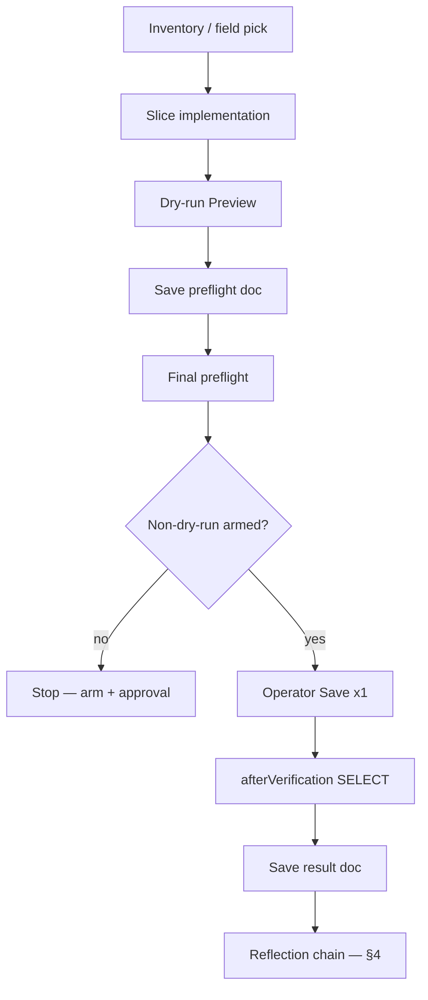
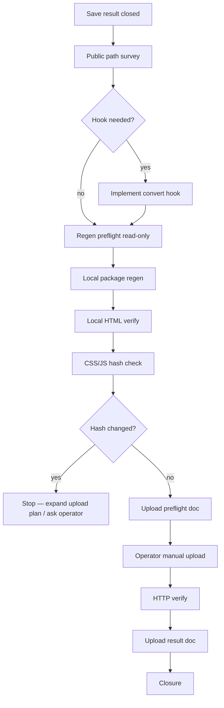

# G-16 — CMS Kit Save / Reflection playbook consolidation

**Phase:** `G-16-cms-kit-save-reflection-playbook-consolidation`  
**Status:** **complete** — doc-only; Save + Reflection standard procedures consolidated from proven Gosaki chains  
**Date:** 2026-06-29  
**Base commit:** `f722cf4`  
**Prior:** G-14c (`gosaki-public-reflection-operation-standardization.md`); G-14b1f / G-15c-f / G-15e-f closure docs

| Check | Status |
| --- | --- |
| Save slice standard procedure | **documented** |
| Reflection standard procedure | **documented** |
| Safety gate classification | **documented** |
| Cursor / operator / ChatGPT roles | **documented** |
| New-field template | **documented** |
| Forbidden patterns | **documented** |
| Proven chain references (G-14b1, G-15 ×2) | **linked** |
| Cursor FTP / Save / DB write / package regen | **no** |

---

## Gates

```txt
cmsKitSaveReflectionPlaybookConsolidationComplete: true
phase: G-16-cms-kit-save-reflection-playbook-consolidation
readyForNextDiscographyFieldSlice: true
readyForNextScheduleFieldSlice: true
readyForAnyFutureFtpApply: false
readyForAnyDbWrite: false
cursorPackageRegenExecuted: false
cursorFtpExecuted: false
cursorSaveExecuted: false
cursorDbWriteExecuted: false
```

**Supabase staging target:** `static-to-astro-cms-staging` / `kmjqppxjdnwwrtaeqjta` only. **STOP** if host is `vsbvndwuajjhnzpohghh` (Sariswing production).

**Routine dev default:** `PUBLIC_ADMIN_WRITE_DRY_RUN=true`; all non-dry-run env arms **off**.

---

## 1. Purpose

G-14 Schedule と G-15 Discography で **3 本の end-to-end チェーン**が成功した。本 playbook は、CMS Kit 汎用化に向けて **Save slice**（admin → DB）と **Reflection**（DB → public staging）の標準手順を 1 ドキュメントに統合する。

**Audience:** Cursor agent, operator (戸山), ChatGPT review thread.

**Relationship to G-14c:** G-14c は **Reflection のみ**を標準化。G-16 は **Save + Reflection の全チェーン**を含む。

---

## 2. Proven success chains (reference)

### 2.1 G-14b1 — Schedule `price` (routine edit)

| Item | Value |
| --- | --- |
| **Closure doc** | `gosaki-schedule-routine-edit-reflection-closure.md` |
| **Table** | `public.schedules` |
| **Row** | `schedule-2026-04-005` |
| **Field** | `price` only |
| **approval_id** | `G-9k-gosaki-schedule-existing-event-save-button-non-dry-run` |
| **Public route** | `/schedule/2026-04/` |
| **Upload** | **1 file** `schedule/2026-04/index.html` |
| **Marker** | `scheduleDataSource=supabase` |

### 2.2 G-15 — Discography `purchase_url`

| Item | Value |
| --- | --- |
| **Closure doc** | `gosaki-discography-public-reflection-closure.md` |
| **Table** | `public.discography` |
| **Row** | `discography-002` / SKYLARK |
| **Field** | `purchase_url` only |
| **approval_id** | `G-15b-gosaki-discography-existing-release-purchase-url-non-dry-run` |
| **Public route** | `/discography/` |
| **Upload** | **1 file** `discography/index.html` |
| **Hook** | `patchGosakiDiscographySupabaseFields` — `purchase_url` |
| **Marker** | `discographyDataSource=supabase` |
| **Infra note** | `GRANT UPDATE` + `discography_set_updated_at` trigger (G-15b-f8) |

### 2.3 G-15 — Discography `artist`

| Item | Value |
| --- | --- |
| **Closure doc** | `gosaki-discography-artist-public-reflection-closure.md` |
| **Table** | `public.discography` |
| **Row** | `discography-003` / About Us!! |
| **Field** | `artist` only |
| **dry-run approval_id** | `G-15d-gosaki-discography-artist-dry-run-slice` |
| **Save approval_id** | `G-15d-gosaki-discography-existing-release-artist-non-dry-run` |
| **Public route** | `/discography/` |
| **Upload** | **1 file** `discography/index.html` |
| **Hook** | same module — `artist` patch added |
| **`updated_at` proof** | trigger live proof **success** on G-15d Save |

**Common pattern across all three:** inventory/planning → dry-run → Save preflight → operator Save **once** → result doc → reflection preflight → local regen → local verify → minimal 1-file upload → HTTP verify → upload result → closure.

---

## 3. Save slice — standard procedure

One **field**, one **row**, one **Save click** per approval ID.

```txt
S0  Inventory / field selection
S1  Implementation (guards, config, UI wiring) — if new slice
S2  Dry-run Preview (operator or local script)
S3  Save preflight doc (beforeSnapshot, rollback SQL doc-only, env stack)
S4  Final preflight (dry-run result recorded, gates green)
S5  Operator non-dry-run arm + Preview (optional re-check)
S6  Operator Save — exactly once
S7  afterVerification (read-only SELECT by operator)
S8  Save result doc + verifier
S9  Closure (after reflection chain complete — or split if reflection deferred)
```



### S0 — Inventory / target row / field selection

| Check | Pass criteria |
| --- | --- |
| Table + column exists | inventory doc / schema survey |
| Row identified | `id`, `legacy_id`, human label |
| Field is **scalar** and safe | no invented URLs; no multi-field creep |
| Closed rows | do not re-Save without new approval |
| `site_slug` | matches site (e.g. `gosaki-piano`) |
| Staging project | `kmjqppxjdnwwrtaeqjta` |

**Reject** field if: null would force invented values (`streaming_url` on null rows — G-15d lesson), or public patch path unknown.

### S1 — Implementation (when new slice)

| Artifact | Purpose |
| --- | --- |
| `*-dry-run-guards.ts` | `assert*PayloadOnly` — single field |
| `*-save-config.ts` / `*-page-config.ts` | target row, approval IDs |
| `DISCOGRAPHY_WRITE_APPROVAL_IDS` / schedule equivalent | register approval |
| Admin UI section | staging shell only (`/__admin-staging-shell/…`) |
| **Single-arm policy** | only one non-dry-run slice armed at a time |

### S2 — Dry-run Preview

| Check | Pass |
| --- | --- |
| `actualWrite: false` | **required** |
| `wouldWrite: true` | when payload valid |
| `changedFields` | **one field only** |
| `expectedBeforeUpdatedAt` | matches current row |
| Cursor did **not** click Save | operator or scripted dry-run only |

### S3 — Save preflight doc

Must include:

- `beforeSnapshot` (all guarded columns)
- intended `after` value
- `approval_id` (Save — distinct from dry-run ID)
- `expectedBeforeUpdatedAt`
- rollback SQL (**documented only** — not executed)
- env stack (inline — do not commit `.env`)
- explicit **do not click Save** in preflight phase

### S4 — Final preflight

- Dry-run result recorded (operator Preview PASS)
- Gates: `readyFor*SaveExecution: true`
- Disarm conflicting arms (e.g. G-15b vs G-15d single-arm)
- ChatGPT / human sign-off if scope is first-of-kind

### S5 — Non-dry-run Preview (optional)

Re-run Preview with non-dry-run armed to confirm gates; **still no Save** until execution phase.

### S6 — Operator Save (once)

| Rule | Detail |
| --- | --- |
| Executor | **Operator only** — not Cursor / Playwright |
| Clicks | **1** Save per approval ID |
| Path | staging admin shell — not `/admin` production |
| Auth | anon + session — **not** `service_role` |
| Optimistic lock | `expectedBeforeUpdatedAt` required |

**Approval phrase (DB write — destructive):**

```txt
承認します。この操作を1回だけ実行してください。
```

### S7 — afterVerification

Operator read-only SELECT confirming:

- `changedFields` match intent
- unrelated columns unchanged
- `updated_at` advanced (when trigger live)
- `rowsAffected === 1`

### S8 — Save result doc

Record: before/after, `updated_at`, trigger proof, `rollbackNeeded: false` default, **do not re-Save** gate.

### S9 — Closure

Written after reflection chain completes (§4). Sets `readyFor*ReExecution: false`, `readyFor*ReUpload: false`.

---

## 4. Reflection — standard procedure

Canonical sequence (extends G-14c §2):

```txt
R0  Write phase closed (Save result doc exists)
R1  Public generation path survey (convert hook / data binding)
R2  Hook implementation (if new public field)
R3  Local regen preflight (read-only DB/JSON check)
R4  Local package regen (build-gosaki-staging-admin-package.mjs)
R5  Local HTML verify (target page + markers + scope creep)
R6  CSS / JS hash compare vs live staging
R7  Minimal upload scope decision
R8  Upload preflight doc
R9  Operator manual overwrite upload — 1+ files per preflight list
R10 HTTP verify (read-only GET)
R11 Upload result doc + verifier
R12 Closure doc
```



### R1 — Public generation path

| Content type | Typical path |
| --- | --- |
| Schedule month | fixture → convert → `schedule/YYYY-MM/index.html`; Supabase read at build |
| Discography | fixture → convert + `supabase-discography-read.mjs` patch → `discography/index.html` |
| Home / YouTube | static JSON → `index.html` |

Document: which Wix HTML pattern is patched, data marker name (`scheduleDataSource`, `discographyDataSource`).

### R4 — Local regen command

```bash
cd tools/static-to-astro
node scripts/build-gosaki-staging-admin-package.mjs
```

**Do not modify** `.env` / `.env.local` in reflection phase.

### R5 — Local HTML verify

| Check | Schedule | Discography |
| --- | --- | --- |
| Target field text | event card on month page | repeater item for album |
| Data marker | `scheduleDataSource=supabase` | `discographyDataSource=supabase` |
| Out-of-scope rows | other months/events unchanged | other albums unchanged |
| Prior chain fields | N/A | e.g. G-15c URL maintained when doing G-15e |
| Audit markers | `[CMS Kit staging]`, `PoC`, `dry-run` absent | same |

### R6 — CSS / JS hash

Compare `public-dist/_astro/*` to live staging.

| Outcome | Upload policy |
| --- | --- |
| Hash **unchanged** | **Minimal HTML-only** candidate (proven: all 3 chains) |
| Hash **changed** | **Stop** — include `_astro/` in plan; do not assume 1-file upload |

### R7 — Minimal upload scope

**Default when proven safe (all three Gosaki chains):**

| Change | Local file | Remote path |
| --- | --- | --- |
| Schedule one event | `schedule/YYYY-MM/index.html` | `/cms-kit-staging/gosaki-piano/schedule/YYYY-MM/index.html` |
| Discography field | `discography/index.html` | `/cms-kit-staging/gosaki-piano/discography/index.html` |

**Manual upload is 1-file unit** when hash unchanged and single page surface — operator may upload multiple files only when preflight doc lists them explicitly.

**Approval phrase (manual upload):**

```txt
承認します。この手動アップロードを1回だけ実行してください。
```

### R9 — Operator upload rules

| Rule | Detail |
| --- | --- |
| Method | FileZilla / Lolipop GUI — **overwrite** |
| FTP auto `--apply` | **suspended** (G-7f) |
| `mirror` / `sync` / `--delete` | **forbidden** |
| Remote root `/` | **blocked** |
| Production / Sariswing | **blocked** |

### R10 — HTTP verify

Read-only `curl` GET; confirm HTTP **200**, target content, marker, no stale values, no audit markers.

### Failure handling (all reflection phases)

```txt
stop immediately
do not retry upload without new preflight
do not mirror-delete remote
do not run deploy-public-dist-ftp.mjs --apply
ask human if outcome unclear
```

---

## 5. Safety gate classification

### 5.1 Low-risk — proceed without mid-task stop

**Speed OK** for Cursor / doc phases:

| Activity | Examples |
| --- | --- |
| Read-only GET / SELECT | live staging HTTP, anon SELECT |
| Inventory / planning docs | field selection, gap analysis |
| Local implementation | guards, hooks, verifiers |
| Local package regen | when explicitly in reflection phase |
| Verifier scripts | doc + HTTP checks |
| AI context updates | `00-current-state.md`, handoff |
| Upload preflight docs | path list, rollback notes |

### 5.2 High-risk — stop; explicit operator approval required

| Activity | Approval |
| --- | --- |
| DB write / Save | `承認します。この操作を1回だけ実行してください。` |
| SQL UPDATE / INSERT / DELETE / UPSERT | separate approval + preflight |
| FTP / manual upload | upload approval phrase (once per upload batch) |
| `workflow_dispatch` / deploy | forbidden unless explicit phase |
| GRANT / RLS / trigger apply | operator + documented rollback |
| Package regen when not in reflection phase | confirm intent |
| `.env` / secrets change | **forbidden** in normal phases |
| `service_role` | **forbidden** |
| Production / Sariswing host | **forbidden** |
| Re-Save / re-upload closed chain | **forbidden** without new approval ID |

### 5.3 Ambiguous outcome — always stop

| Signal | Action |
| --- | --- |
| Save returned but afterSnapshot missing | no regen |
| Regen verify FAIL | no upload |
| FTP timeout / wrong folder | no HTTP success assumption |
| HTTP 200 but wrong body | no closure; no blind re-upload |
| Hash changed but plan says 1-file | stop and report |

---

## 6. Role split — Cursor / operator / ChatGPT

### 6.1 Cursor (agent)

| Do | Do not |
| --- | --- |
| Inventory, implementation, guards, hooks | Click Save / Run / Preview in non-dry-run |
| Dry-run scripts, local regen when phase allows | FTP upload |
| Preflight / result / closure docs | DB write / SQL mutation |
| Verifiers, read-only HTTP GET | Modify `.env` / secrets |
| AI context updates | `service_role` |
| Report upload plan | Auto-click write buttons |

### 6.2 Operator (戸山)

| Do | Do not |
| --- | --- |
| Arm non-dry-run env (inline, not committed) | Re-Save closed rows without new approval |
| Dry-run + non-dry-run Preview in browser | `mirror --delete` |
| Save **once** per approval | Upload without preflight doc |
| afterVerification SELECT | Touch production |
| Manual FTP overwrite per file list | Upload to FTP root `/` |
| Visual + HTTP confirmation | |

### 6.3 ChatGPT (review thread)

Use when:

- First-of-kind slice (new table or field type)
- Scope creep risk (multi-row, multi-field)
- Permission / grant / trigger needed
- Upload scope uncertain (hash changed, multi-page)
- Incident or ambiguous outcome
- Destructive approval wording review

Paste `handoff-to-chatgpt.md` at thread start; confirm phase gates before high-risk steps.

---

## 7. New field slice — template

Copy per new Save + Reflection cycle:

```txt
## G-{phase} — {site} {content} {field} slice

### Target
- table:
- legacy_id:
- id:
- field: (one only)
- before → after:
- public route:
- closed rows to avoid:

### Approval IDs
- dry-run: G-{x}-...-dry-run-slice
- Save:    G-{x}-...-non-dry-run
- (never reuse closed chain IDs)

### Env stack (inline — not committed)
- PUBLIC_ADMIN_WRITE_DRY_RUN=false (execution only)
- PUBLIC_ADMIN_{SITE}_{CONTENT}_{FIELD}_NON_DRY_RUN_ARMED=true
- disarm all other non-dry-run arms

### Optimistic lock
- expectedBeforeUpdatedAt: (from beforeSnapshot)

### changedFields
- ["{field}"] only

### Rollback
- rollbackNeeded: false (default)
- rollback SQL: (doc-only, staging only)

### Public reflection
- needed: yes / no
- hook module:
- patch rule:
- data marker:
- local path:
- remote path:
- upload files: (count + list)

### Gates (on completion)
- readyFor*SaveExecution: false
- readyFor*ReSave: false
- readyFor*ReUpload: false
```

### approvalId naming convention

```txt
G-{phase}-{site}-{content}-{field}-dry-run-slice
G-{phase}-{site}-{content}-{field}-non-dry-run
```

Examples:

- `G-15b-gosaki-discography-existing-release-purchase-url-non-dry-run`
- `G-15d-gosaki-discography-existing-release-artist-non-dry-run`
- `G-9k-gosaki-schedule-existing-event-save-button-non-dry-run`

### Phase doc naming

| Phase type | Filename pattern |
| --- | --- |
| Save preflight | `gosaki-{content}-{field}-save-preflight.md` |
| Dry-run result | `gosaki-{content}-{field}-local-dry-run-result-and-save-final-preflight.md` |
| Save result | `gosaki-{content}-{field}-save-result.md` |
| Reflection preflight | `gosaki-{content}-{field}-public-reflection-local-regen-and-upload-preflight.md` |
| Upload result | `gosaki-{content}-{field}-public-reflection-upload-result.md` |
| Closure | `gosaki-{content}-{field}-public-reflection-closure.md` |

---

## 8. Forbidden patterns

| Pattern | Why forbidden |
| --- | --- |
| **Re-Save** same row/field after closure | optimistic lock + audit; new approval required |
| **Re-upload** same HTML after upload closure | stale risk; new approval required |
| **`mirror` / `sync` / `--delete`** | G-7f incident |
| **FTP root `/`** upload | production wipe risk |
| **Production** host / Sariswing project | out of staging scope |
| **`service_role`** in Kit paths | bypasses RLS; not Kit model |
| **`.env` / secrets** commit or agent edit | credential leak |
| **approvalId mismatch** | guard rejects or wrong audit trail |
| **Multi-field Save** | scope creep; one field per slice |
| **Multi-row Save** | scope creep; one row per slice |
| **Cursor Save click** | operator-only destructive action |
| **Auto FTP `--apply`** | suspended until G-7f1 re-approval |
| **`/admin` production** changes | staging shell only unless explicit phase |
| **`schedule_months` write** | derived / read-only |
| **Playwright write buttons** | safety rules |

---

## 9. Quick reference — proven upload minimal scope

| Chain | Files uploaded | CSS hash |
| --- | --- | --- |
| G-14b1 Schedule `price` | 1 × `schedule/2026-04/index.html` | unchanged |
| G-15 `purchase_url` | 1 × `discography/index.html` | unchanged |
| G-15 `artist` | 1 × `discography/index.html` | unchanged |

---

## 10. Related docs

| Topic | Doc |
| --- | --- |
| Reflection detail (G-14c) | `gosaki-public-reflection-operation-standardization.md` |
| G-14b1 closure | `gosaki-schedule-routine-edit-reflection-closure.md` |
| G-15 purchase_url closure | `gosaki-discography-public-reflection-closure.md` |
| G-15 artist closure | `gosaki-discography-artist-public-reflection-closure.md` |
| FTP safety | `ftp-deploy-root-delete-incident-and-safety-hardening.md` |
| Manual upload package | `gosaki-manual-staging-upload-package.md` |
| Discography inventory | `gosaki-discography-cms-mvp-inventory-and-plan.md` |
| Regen script | `scripts/build-gosaki-staging-admin-package.mjs` |

---

## 11. Forbidden operations — not performed (this phase)

| Operation | Executed |
| --- | --- |
| FTP / upload | **no** |
| package regen | **no** |
| Save / DB write | **no** |
| deploy / workflow_dispatch | **no** |
| commit / push | **no** |

---

## 12. Verifier

```bash
node tools/static-to-astro/scripts/verify-g16-cms-kit-save-reflection-playbook.mjs
```
