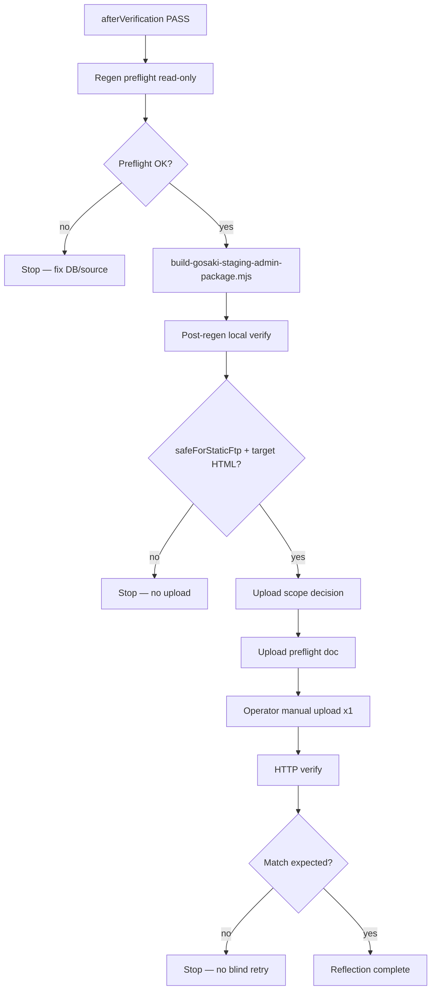

# G-14c — Gosaki public reflection operation standardization

**Phase:** `G-14c-gosaki-public-reflection-operation-standardization`  
**Status:** **complete** — public reflection operator playbook standardized (doc-only)  
**Date:** 2026-06-27  
**Base commit:** `70658c0`  
**Prior:** G-14b practical editing flow; G-13d1→G-13e Event A reflection chain closed

| Check | Status |
| --- | --- |
| Standard reflection flow documented | **yes** |
| Minimal vs full upload rules | **yes** |
| Schedule / YouTube / Event B playbooks | **yes** |
| Failure stop conditions | **yes** |
| G-13c2 prerequisite shape | **yes** |
| Cursor FTP / Save / DB write / package regen | **no** |

---

## Gates

```txt
gosakiPublicReflectionOperationStandardizationComplete: true
phase: G-14c-gosaki-public-reflection-operation-standardization
readyForG13c2EventBCleanupReflection: true
readyForG14b1PracticalEditReflection: true
readyForAnyFutureFtpApply: false
readyForAnyDbWrite: false
cursorPackageRegenExecuted: false
cursorFtpExecuted: false
cursorSaveExecuted: false
cursorDbWriteExecuted: false
```

**Routine dev:** reflection phases are **operator-driven** after an approved Save or JSON/workflow change.

**Approval phrase (manual upload — all reflection types):**

```txt
承認します。この手動アップロードを1回だけ実行してください。
```

---

## 1. Purpose

G-13e で **DB → local regen → 1-file upload → HTTP verify** は Event A で成功した。本フェーズは、その手順を **Gosaki CMS 共通の public reflection 運用**として標準化する。

**Applies to:**

- G-14b routine Schedule edits (future)
- G-13c2 Event B cleanup (next gated write)
- YouTube URL changes (G-11c pattern — already proven)
- Any staging DB or static JSON change that affects public HTML

**Out of scope (this phase):** FTP execution, package regen, Save, production cutover.

---

## 2. Standard public reflection flow

Canonical sequence (all change types):

```txt
Phase 0 — Write complete
  afterVerification SELECT (Save / workflow / JSON patch succeeded)

Phase 1 — Regen preflight (read-only)
  confirm DB/JSON source matches intent
  confirm staging project ref (kmjqppxjdnwwrtaeqjta)
  confirm no scope creep (Event B, unrelated months, etc.)

Phase 2 — Local regen
  cd tools/static-to-astro
  node scripts/build-gosaki-staging-admin-package.mjs

Phase 3 — Post-regen verify (local)
  verify-static-public-artifact → safeForStaticFtp: true
  npm run verify:manual-upload → PASS
  scan changed files vs live staging (CSS hash, target HTML)

Phase 4 — Upload scope decision
  minimal upload OR full public-dist upload

Phase 5 — Upload preflight doc
  local path, remote path, file list, blocked paths, rollback note

Phase 6 — Operator manual overwrite upload (once)
  FileZilla / Lolipop GUI only

Phase 7 — HTTP verify (live staging)

Phase 8 — Result doc + closure (optional commit)
```



---

## 3. Phase 0 — afterVerification (prerequisite)

**Do not start regen** until write phase is closed.

| Check | Schedule (Supabase) | YouTube (JSON workflow) |
| --- | --- | --- |
| Write succeeded | `errorCode` absent; adapter success | workflow run success; JSON committed |
| Target confirmed | `afterSnapshot` id / legacy_id / date | `embedCode` / video id in local JSON |
| `updated_at` advanced | yes (Schedule) | N/A |
| `changedFields` only intended | yes | embed field only |
| Rollback needed | default **no** | default **no** |

---

## 4. Phase 1 — Local regen preflight (read-only)

### 4.1 When regen is required

| Trigger | Regen required |
| --- | --- |
| Schedule row changed on staging Supabase | **yes** |
| `gosaki-piano-youtube-embed.json` changed (workflow) | **yes** |
| About/bands static JSON changed | **yes** |
| CSS / convert hook / site overrides changed in repo | **yes** |
| Live HTML already matches DB (spot-check) | **no** — skip upload too |
| DB Save failed or ambiguous | **no** — **stop** |

### 4.2 Pre-regen DB confirmation (Schedule)

**Method:** read-only anon SELECT (same as G-13e local regen doc).

| Check | Pass criteria |
| --- | --- |
| Supabase host | `kmjqppxjdnwwrtaeqjta.supabase.co` |
| `site_slug` | `gosaki-piano` |
| Target row | id / legacy_id / date match Save afterSnapshot |
| Field values | match intended post-Save state |
| Month bucket row count | stable vs expectation (optional) |
| PoC markers | only if cleanup slice — absent in DB before regen |

**Stop if:** fallback/static read, wrong project ref, row mismatch, or DB still shows pre-edit values.

### 4.3 Pre-regen JSON confirmation (YouTube)

| Check | Pass criteria |
| --- | --- |
| File | `tools/static-to-astro/config/sites/gosaki-piano-youtube-embed.json` |
| `embedCode` | contains expected `youtube-nocookie.com/embed/{id}` |
| Old video id absent | e.g. `Ke4F8JAQz-I` not in package after regen |

---

## 5. Phase 2 — Local regen command

```bash
cd tools/static-to-astro
node scripts/build-gosaki-staging-admin-package.mjs
```

**Env:** reads repo `.env` / `.env.local` — **do not modify** in reflection phase.

**Pipeline (automatic):**

```txt
convert-static-to-astro.mjs  fixtures/gosaki-piano → output/gosaki-piano-astro
verify-static-public-artifact.mjs
npm run manual-upload:package
npm run verify:manual-upload
```

**Output root:** `tools/static-to-astro/output/manual-upload/gosaki-piano/public-dist/`

---

## 6. Phase 3 — Post-regen local verification

| # | Check | Command / location |
| --- | --- | --- |
| 1 | Build exit code | script ends `G-11c4b package build: PASS` |
| 2 | `safeForStaticFtp` | `output/static-public/gosaki-piano/STATIC_PUBLIC_ARTIFACT_REPORT.md` |
| 3 | Manual-upload manifest | `output/manual-upload/gosaki-piano/MANIFEST.json` |
| 4 | `verify:manual-upload` | **PASS** |
| 5 | `deployBase` | `/cms-kit-staging/gosaki-piano/` |
| 6 | Target HTML content | grep / manual inspect changed page |
| 7 | `scheduleDataSource=supabase` | in schedule month HTML (Schedule changes) |
| 8 | Intermediate JSON | `output/gosaki-piano-astro/src/data/gosaki-schedules.json` reflects DB |
| 9 | CSS hash | list `public-dist/_astro/*.css` — compare to **live** staging |
| 10 | Scope creep scan | unrelated months / Event B / PoC markers not in scope |

**Stop if:** any verify FAIL, `scheduleDataSource=static-fallback`, secrets in package, or unexpected file churn.

---

## 7. Upload scope decision

### 7.1 Decision tree

```txt
1. Compare local _astro/*.css hash(es) to live staging _astro/
   → CHANGED → include _astro/ in upload (minimal set: changed CSS files)
   → UNCHANGED → HTML-only candidate

2. Did hub /schedule/index.html change?
   → YES (month set, links, copy) → add schedule/index.html

3. Did home index.html change?
   → YES (YouTube, layout) → add index.html (+ _astro if needed)

4. Did multiple month pages change?
   → YES → upload each changed schedule/YYYY-MM/index.html
   → OR full public-dist if >3 pages or uncertainty

5. Did admin/ change and need staging admin update?
   → separate decision (G-11b) — not part of Schedule reflection default

6. Default when 1–5 are NO and single month card changed:
   → MINIMAL: schedule/YYYY-MM/index.html only
```

### 7.2 Minimal upload — use when ALL true

| Criterion | Detail |
| --- | --- |
| CSS / JS hash | **Unchanged** vs live `_astro/` |
| Change surface | **Single month page** HTML only (G-13e proven) |
| Hub | `schedule/index.html` **unchanged** |
| Home | `index.html` **unchanged** |
| Admin | no admin package intent |
| Public effect | **One** `schedule/YYYY-MM/index.html` updates live card(s) |

**G-13e example:** 1 file — `schedule/2026-03/index.html` → remote `/cms-kit-staging/gosaki-piano/schedule/2026-03/index.html`

### 7.3 Full upload — use when ANY true

| Criterion | Detail |
| --- | --- |
| CSS / JS hash | **Changed** — must upload `_astro/*` (and pages referencing new hash) |
| Multi-page | **2+** unrelated HTML paths changed |
| Hub / home | `schedule/index.html` and/or `index.html` changed |
| Layout / convert hook | global CSS, header, footer, deployBase SEO |
| YouTube home | `index.html` embed change (G-11c13 used **full 27 files**) |
| Uncertainty | operator cannot prove minimal scope safe |
| First reflection after major code change | full package safer |

**Full upload definition:** all **contents** of `public-dist/` (typically **27 files**) → `/cms-kit-staging/gosaki-piano/` — overwrite, **no** mirror-delete.

### 7.4 Upload scope quick reference

| Change type | Typical scope | Reference |
| --- | --- | --- |
| Schedule — one event, one month | **1 file** `schedule/YYYY-MM/index.html` | G-13e |
| Schedule — hub month list | `schedule/index.html` + affected month(s) | G-14c-defer |
| Schedule — date/month move | **full** or multi-month + hub | deferred MVP |
| YouTube embed URL | **full public-dist** (or `index.html` + `_astro` if hash changed) | G-11c13 |
| Event B cleanup | **1 file** `schedule/2026-07/index.html` | G-13c2 (planned) |
| About / Contact content | page-specific HTML (+ assets if images) | G-10h* |

---

## 8. Phase 5–6 — Upload preflight & execution

### 8.1 Remote destination (staging only)

| Item | Value |
| --- | --- |
| Host | `yskcreate.weblike.jp` (Lolipop — operator credentials) |
| Remote root | `/cms-kit-staging/gosaki-piano/` |
| Public URL | `https://yskcreate.weblike.jp/cms-kit-staging/gosaki-piano/` |

### 8.2 Blocked targets

| Target | Status |
| --- | --- |
| FTP account root `/` | **blocked** (G-7f) |
| Sariswing production | **blocked** |
| `gosaki-piano.com` production | **blocked** |
| `mirror --delete` / remote `rm` | **forbidden** |
| `deploy-public-dist-ftp.mjs --apply` | **suspended** |

### 8.3 Pre-upload stop conditions

**Do not upload** if any:

| # | Condition |
| --- | --- |
| 1 | Remote path unclear or not under `cms-kit-staging/gosaki-piano/` |
| 2 | Local package verify not PASS |
| 3 | `scheduleDataSource` not `supabase` when DB-driven schedule expected |
| 4 | Staging project ref wrong in generated JSON |
| 5 | Out-of-scope file in upload set (e.g. Event B month when only Event A changed) |
| 6 | CSS hash changed but `_astro/` omitted from upload plan |
| 7 | Operator approval phrase not given |
| 8 | Prior upload outcome ambiguous |

### 8.4 Operator upload procedure

1. FTP connect; remote pane → `/cms-kit-staging/gosaki-piano/…`
2. **Abort** if remote pane shows `/` or wrong site folder
3. Local pane → `output/manual-upload/gosaki-piano/public-dist/…`
4. Select **only** files from preflight list
5. Upload **overwrite** — no sync-delete
6. Confirm remote timestamp/size
7. HTTP verify (section 9)

---

## 9. Phase 7 — HTTP verify

### 9.1 Common checks

| # | Check | Pass |
| --- | --- | --- |
| 1 | HTTP status | **200** |
| 2 | Primary content | matches local package target |
| 3 | `scheduleDataSource=supabase` | when Schedule DB-driven |
| 4 | No stale PoC text | when cleanup slice |
| 5 | Out-of-scope pages | unchanged (optional spot-check) |

### 9.2 Schedule month page

**URL:** `https://yskcreate.weblike.jp/cms-kit-staging/gosaki-piano/schedule/YYYY-MM/`

Verify **event card** for edited `date` — field text matches afterSnapshot / local HTML.

```bash
curl -sS -o /dev/null -w "%{http_code}\n" \
  "https://yskcreate.weblike.jp/cms-kit-staging/gosaki-piano/schedule/2026-03/"

curl -sS "https://yskcreate.weblike.jp/cms-kit-staging/gosaki-piano/schedule/2026-03/" \
  | rg "scheduleDataSource|2026\.03\.15|G-9k6"
```

### 9.3 YouTube home

**URL:** `https://yskcreate.weblike.jp/cms-kit-staging/gosaki-piano/`

| Check | Pass |
| --- | --- |
| New embed id in iframe | present |
| Old embed id | absent |

### 9.4 Post-upload stop conditions

| Situation | Action |
| --- | --- |
| HTTP not 200 | **Stop** — diagnose path |
| Content still stale | **Stop** — verify remote path, cache; **no** blind re-upload |
| Wrong event/card changed | **Stop** — incident doc |
| Out-of-scope regression | **Stop** — e.g. Event B changed when not in scope |
| Partial/corrupt upload | **Stop** — no remote delete |
| Unclear outcome | **Stop** — ask human (G-7f policy) |

---

## 10. Failure / ambiguous result handling

```txt
FAIL → record: Save done? regen done? upload done? which files?
     → do NOT auto-rollback
     → do NOT retry upload without new preflight
     → do NOT mirror-delete remote
     → do NOT run deploy-public-dist-ftp.mjs --apply
     → ask human if any step outcome unclear
```

| Layer | Ambiguous signal | Stop point |
| --- | --- | --- |
| DB | Save returned but afterSnapshot missing | Before regen |
| Regen | verify FAIL or static-fallback | Before upload |
| Upload | FTP timeout / wrong folder | Before HTTP assume success |
| HTTP | 200 but wrong body | Before closure / commit |

---

## 11. Rollback policy

| Situation | Policy |
| --- | --- |
| Regen前に問題 | 未 upload — no rollback needed |
| Upload後に表示不正 | **Stop**; forward fix preferred |
| Automatic rollback SQL | **not executed** by default |
| HTML rollback | Re-upload **saved pre-upload** live HTML backup if operator kept copy |
| DB rollback | Separate approval + preflight — **not** part of reflection playbook |
| G-13e Event A | `rollbackNeeded: false` after verify PASS |

**Document rollback SQL in write preflight only** — never auto-run during reflection.

---

## 12. Application playbooks

### 12.1 Schedule CMS edit (G-14b product path)

```txt
G-14b Save + afterVerification
  → §4.2 DB preflight (target row + month)
  → regen (§5)
  → post-regen: schedule/YYYY-MM/index.html + scheduleDataSource
  → upload scope: minimal if §7.2 all true
  → HTTP verify: edited event card on /schedule/YYYY-MM/
  → result doc
```

**Month derivation:** `YYYY-MM` from `afterSnapshot.date` (first 7 chars).

### 12.2 YouTube URL change (G-11c)

```txt
workflow dispatch + JSON patch verified
  → regen (§5)
  → post-regen: index.html embed id
  → upload scope: full public-dist (G-11c13) OR index.html + _astro if hash changed
  → HTTP verify: home embed
  → G-11c15-style result doc
```

**Note:** YouTube does **not** use Supabase schedule read; `scheduleDataSource` checks N/A on home.

### 12.3 Event B cleanup (G-13c2 — prerequisite)

Mirror G-13c1→G-13e with G-14c standard phases:

| Item | Value |
| --- | --- |
| Write | G-13c2 Save (6 fields) on `aa440e29…` |
| DB preflight | row `schedule-2026-07-010`; PoC absent in DB |
| Regen | same `build-gosaki-staging-admin-package.mjs` |
| Local verify | July HTML clean; March **unchanged**; Event B PoC absent in `schedule/2026-07/index.html` |
| Upload | **minimal** `schedule/2026-07/index.html` |
| HTTP | `https://yskcreate.weblike.jp/cms-kit-staging/gosaki-piano/schedule/2026-07/` |
| Event A | **must remain** clean — spot-check March optional |
| approval | separate G-13c2 write + upload approvals |

**Gate:** `readyForG13c2EventBCleanupReflection: true` after this doc.

---

## 13. High-risk vs low-risk

### Low-risk (doc / verify only)

- G-14c preflight docs
- Read-only DB SELECT before regen
- `verify-g14c-*` / HTTP curl read-only
- Upload scope decision worksheet
- Saving live HTML backup before upload

### High-risk (explicit approval each time)

- `build-gosaki-staging-admin-package.mjs` (when triggered)
- Any FTP upload
- Full 27-file upload
- Re-upload after failed verify without diagnosis
- DB rollback SQL execution

---

## 14. Artifacts & paths reference

| Artifact | Path |
| --- | --- |
| Regen script | `tools/static-to-astro/scripts/build-gosaki-staging-admin-package.mjs` |
| Static verify | `tools/static-to-astro/scripts/verify-static-public-artifact.mjs` |
| Upload package | `tools/static-to-astro/output/manual-upload/gosaki-piano/public-dist/` |
| Manifest | `output/manual-upload/gosaki-piano/MANIFEST.json` |
| Schedule JSON | `output/gosaki-piano-astro/src/data/gosaki-schedules.json` |
| G-13e template | `gosaki-schedule-event-a-poc-cleanup-public-reflection-*.md` |
| G-11c template | `gosaki-youtube-url-save-staging-upload-preflight.md` |
| FTP safety | `ftp-deploy-root-delete-incident-and-safety-hardening.md` |

---

## 15. Next phases

| Order | Phase | Notes |
| --- | --- | --- |
| **1** | **G-13c2** | Event B cleanup — use §12.3 |
| **2** | **G-14b1** | Practical Schedule Save enablement |
| **3** | **G-14b1-exec** | First routine edit + this playbook |
| **4** | **G-14d** | Admin UI hardening |

---

## 16. Prohibited operations — not performed (this phase)

| Operation | Executed |
| --- | --- |
| FTP / upload | **no** |
| package regen | **no** |
| Save / DB write | **no** |
| deploy / workflow_dispatch | **no** |
| commit / push | **no** |

---

## 17. Verifier

```bash
node tools/static-to-astro/scripts/verify-g14c-gosaki-public-reflection-operation-standardization.mjs
```

---

## 18. Reference index

| Topic | Doc |
| --- | --- |
| G-14b edit flow | `gosaki-schedule-cms-practical-editing-flow-definition.md` |
| G-13e Event A chain | `gosaki-schedule-event-a-poc-cleanup-public-reflection-closure.md` |
| G-14a roadmap | `gosaki-cms-completion-roadmap-gap-inventory.md` |
| Manual upload package | `gosaki-manual-staging-upload-package.md` |
