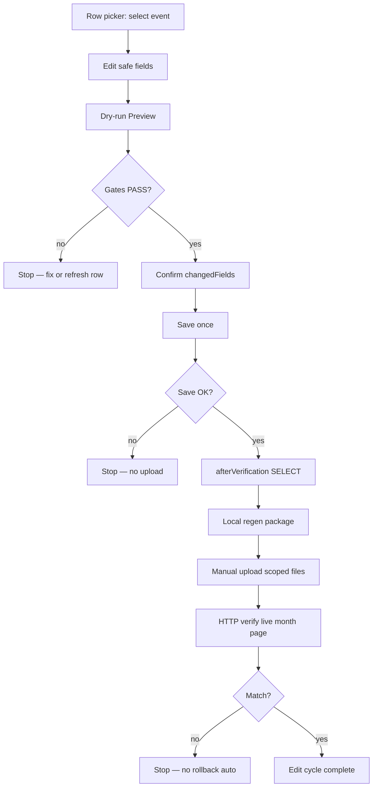

# G-14b — Gosaki Schedule CMS practical editing flow definition

**Phase:** `G-14b-gosaki-schedule-cms-practical-editing-flow-definition`  
**Status:** **complete** — practical Schedule editing flow defined (doc-only)  
**Date:** 2026-06-27  
**Base commit:** `995877c`  
**Prior:** G-14a roadmap (`gosaki-cms-completion-roadmap-gap-inventory.md`); G-13d1→G-13e Event A chain closed

| Check | Status |
| --- | --- |
| Operator journey defined | **yes** |
| Routine / failure flows documented | **yes** |
| MVP vs defer scope classified | **yes** |
| PoC vs practical path gap analyzed | **yes** |
| G-13c2 / G-14c connection documented | **yes** |
| Cursor FTP / Save / DB write | **no** |

---

## Gates

```txt
gosakiScheduleCmsPracticalEditingFlowDefinitionComplete: true
phase: G-14b-gosaki-schedule-cms-practical-editing-flow-definition
readyForG14cPublicReflectionOperationStandardization: true
readyForG14b1PracticalEditSaveEnablement: false
readyForG13c2EventBCleanup: false
readyForAnyDbWrite: false
readyForAnyFutureFtpApply: false
cursorFtpExecuted: false
cursorSaveExecuted: false
cursorDbWriteExecuted: false
```

**Routine dev:** `PUBLIC_ADMIN_WRITE_DRY_RUN=true`; all non-dry-run arms off.

---

## 1. Purpose

G-13 で **DB Save → local regen → manual upload → HTTP verify** は実証済み。本フェーズは Schedule CMS を **PoC 用の特別 Save** から **運用可能な編集フロー** に落とし込む定義を固定する。

**Out of scope (this phase):** implementation, Save, DB write, upload, client preview.

---

## 2. Target system

| Item | Value |
| --- | --- |
| **site_slug** | `gosaki-piano` |
| **Supabase project** | `static-to-astro-cms-staging` / `kmjqppxjdnwwrtaeqjta` |
| **Primary UI** | Gosaki operator Schedule page — row picker + edit form + 「変更を確認」/「更新する」 |
| **Code anchor** | `gosaki-staging-schedule-operator-ui.ts` (G-9k path) |
| **Save executor** | `gosaki-schedule-existing-event-save-button-save.ts` |
| **approval_id (product path)** | `G-9k-gosaki-schedule-existing-event-save-button-non-dry-run` |
| **Public staging** | `https://yskcreate.weblike.jp/cms-kit-staging/gosaki-piano/` |

---

## 3. Operator journey (実用 Schedule 編集)

### 3.1 Preconditions (operator)

```txt
□ staging Supabase にログイン済み（local shell または online admin）
□ PUBLIC_ADMIN_WRITE_DRY_RUN=false は **non-dry-run Save 時のみ**（実装フェーズで arm）
□ 対象行が picker で選択可能（PoC audit 行は運用編集から除外 — 別トラック）
□ 編集意図が明確（どのイベントのどのフィールドを変えるか）
□ public reflection まで行う時間がある（Save だけで終わらない）
```

### 3.2 Journey steps

| Step | Actor | Action | Output |
| --- | --- | --- | --- |
| **1** | Operator | Schedule 一覧から **行を選択**（row picker） | `selectedRowId`, `beforeSnapshot` |
| **2** | Operator | 6 safe field を編集 | Form values |
| **3** | Operator | **「変更を確認」**（dry-run Preview） | `changedFields`, gate status, stale check |
| **4** | Operator | Preview 結果を目視確認 | Go / no-go |
| **5** | Operator | **「更新する」** を **1回**（non-dry-run Save） | DB UPDATE |
| **6** | System / Operator | **afterVerification**（SELECT / UI afterSnapshot） | `updated_at` 更新確認 |
| **7** | Operator | **local regen** | `output/manual-upload/gosaki-piano/public-dist/` |
| **8** | Operator | **manual upload**（最小スコープ） | Live staging HTML |
| **9** | Operator / script | **HTTP verify** | Month page matches DB |
| **10** | Operator | 結果 doc / closure（初回実装時） | Phase closed |



---

## A. Routine edit flow (標準フロー)

### A.1 Existing event edit — canonical sequence

```txt
row選択（picker）
  ↓
編集（title / venue / open_time / start_time / price / description）
  ↓
dry-run Preview（「変更を確認」）
  ↓
changedFields 確認（UI chips + diff preview）
  ↓
Save 1回（「更新する」— multi-field OK）
  ↓
afterVerification（afterSnapshot / beforeAfterDiff / updated_at）
  ↓
local regen（build-gosaki-staging-admin-package.mjs）
  ↓
public reflection（G-14c playbook — minimal upload）
  ↓
HTTP verify（live /schedule/YYYY-MM/）
```

### A.2 Existing event edit — standard flow details

| Stage | Requirement |
| --- | --- |
| **Row selection** | Picker lists `site_slug=gosaki-piano` rows; `isPocAuditScheduleRow` excluded from routine ops |
| **Multi-field** | **1 Save = all changed safe fields** in one UPDATE (G-13d1 / G-9g3d pattern) |
| **Single-arm** | Only one non-dry-run write arm active per dev session |
| **Optimistic lock** | `expectedBeforeUpdatedAt` from dry-run `beforeSnapshot.updated_at` |
| **Auth** | Staging Supabase session; project allowlist PASS |
| **No re-Save** | Same row without fresh Preview if `updated_at` changed |

### A.3 Dry-run Preview の位置づけ

| Role | Detail |
| --- | --- |
| **Mandatory gate** | Save **前に必須** — `dryRunOk` false なら Save blocked |
| **No DB write** | SELECT + client-side diff only |
| **Outputs** | `changedFields[]`, payload preview, optimistic lock stale flag, save readiness |
| **Operator duty** | 意図しない field が changedFields に入っていないか確認 |
| **Re-Preview** | フォーム変更後は再 Preview；Save 後は row 再読込 |

**Routine dev default:** `PUBLIC_ADMIN_WRITE_DRY_RUN=true` → Preview runs dry-run path; Save disabled until explicit arm (implementation phase).

### A.4 Save 前の確認条件

All must PASS before 「更新する」:

| # | Condition | Source |
| --- | --- | --- |
| 1 | Staging auth signed in | `isSignedInStagingAuth` |
| 2 | Supabase host gate | `kmjqppxjdnwwrtaeqjta` |
| 3 | Project allowlist | `evaluateStagingProjectAllowlist` |
| 4 | `site_slug === gosaki-piano` | `assertBeforeSnapshotSiteSlugScope` |
| 5 | Target row id matches picker selection | `beforeSnapshot.id` |
| 6 | `legacy_id` unchanged in payload | forbidden field guard |
| 7 | `changedFields.length > 0` | dry-run result |
| 8 | Only safe fields in `changedFields` | `assertG9kExistingEventSaveButtonChangedFieldsOnly` |
| 9 | Optimistic lock baseline present | `updated_at` not null when lock enabled |
| 10 | Not stale (dry-run stale check) | `optimisticLockStale === false` |
| 11 | Save compile gate + env arm | `saveEnabled === true` (impl phase) |
| 12 | Single non-dry-run arm | other registry arms off |

### A.5 Save 後の DB 確認（afterVerification）

| Check | Method |
| --- | --- |
| **Write succeeded** | `errorCode` absent; adapter `success` |
| **Rows affected** | Exactly 1 |
| **afterSnapshot** | SELECT post-update (adapter returns `afterSnapshot`) |
| **changedFields match** | `beforeAfterDiff` only lists intended fields |
| **updated_at advanced** | `afterSnapshot.updated_at > beforeSnapshot.updated_at` |
| **Forbidden fields unchanged** | `date`, `legacy_id`, `site_slug`, `published`, etc. |
| **Operator record** | Copy `beforeRecord` / `afterRecord` to execution result doc |

**If afterVerification fails:** **stop** — do not regen, do not upload.

### A.6 Public reflection への接続（G-14c）

Save + afterVerification が PASS したら **Phase 2（reflection）** へ。詳細手順は **G-14c** で標準化。

| Trigger | Minimal upload (proven G-13e) |
| --- | --- |
| Schedule text field edit only | `schedule/YYYY-MM/index.html` (month from `beforeSnapshot.date`) |
| Hub month list unchanged | `/schedule/index.html` **not required** if month set unchanged |
| CSS unchanged | `_astro/` **not required** |

**G-14c deliverable:** regen command, upload preflight template, HTTP verify script, approval phrase.

### A.7 Rollback の扱い

| Situation | Policy |
| --- | --- |
| **Save 前に Preview で問題発見** | 編集を戻す — DB 未変更 |
| **Save 成功・reflection 前** | forward fix only；automatic rollback SQL **実行しない** |
| **Save 成功・upload 後に表示不正** | **stop**；incident doc；forward fix（再 Save または再 upload）は **新 approval** |
| **Preflight rollback SQL** | Doc-only reference；**frozen PoC rows 以外では原則不要** |
| **G-13c1 / G-13c2 cleanup** | Doc に rollback SQL 記載可；**実行は operator 明示承認時のみ** |

**Default:** `rollbackNeeded: false` after successful verify (G-13e pattern).

---

## B. Emergency stop / failure flow

**即停止** — 次工程に進まない:

| Failure | Stop point | Action |
| --- | --- | --- |
| **stale / optimistic lock conflict** | Before or at Save | Refresh row；re-Preview；**no Save** |
| **target row mismatch** | Preview / Save | Re-select row；verify picker id |
| **site_slug mismatch** | Preview / Save | **abort** — wrong project/row |
| **legacy_id mismatch** | Save guards | **abort** — data integrity |
| **unexpected changedFields** | After Preview | Fix form；re-Preview |
| **network error** | Preview / Save | **stop**；retry only after state clear |
| **Save result ambiguous** | After Save | **no upload**；SELECT manual confirm |
| **upload path mismatch** | Before upload | **abort** — G-7f path rules |
| **HTTP verify mismatch** | After upload | **stop**；do not retry upload blindly |

```txt
FAIL → record what succeeded (Save? upload?)
     → do not auto-rollback
     → do not retry Save without new Preview
     → ask human if outcome unclear
```

---

## 4. Editable fields — classification

### 4.1 MVP safe fields (multi-field Save OK)

| Field | MVP | Risk | Notes |
| --- | --- | --- | --- |
| **title** | ✅ | Low | Non-empty required |
| **venue** | ✅ | Low | Nullable text |
| **open_time** | ✅ | Low | Display string |
| **start_time** | ✅ | Low | Display string |
| **price** | ✅ | Low | Display string |
| **description** | ✅ | Low | Multi-line；出演・URL 等 |

**Code:** `G9J_EXISTING_EVENT_UPDATE_SAFE_FIELDS` = same six fields.

### 4.2 Deferred fields (not in practical MVP)

| Field | MVP | Risk | Reason |
| --- | --- | --- | --- |
| **date** | ❌ Defer | **High** | Month page routing；legacy_id coupling；card placement |
| **month** (derived) | ❌ Defer | **High** | Derived from `date`；wrong month = wrong `/schedule/YYYY-MM/` |
| **published** | ❌ Defer | Medium | Visibility on public site |
| **show_on_home** | ❌ Defer | Medium | Top page surfacing |
| **image_url** | ❌ Defer | High | Storage / upload |
| **legacy_id** | ❌ Forbidden | **High** | Immutable in UPDATE guards |
| **site_slug** | ❌ Forbidden | **High** | Tenant scope |
| **schedule_months** | ❌ Forbidden | **High** | Derived read-only |

### 4.3 date/month policy

```txt
初期実用 MVP では date / month は編集対象に含めない。
日付変更が必要な場合は別フェーズ（G-14b-defer-date-change）で
  - legacy_id 再採番
  - 旧月・新月 HTML 両方の regen/upload
  - hub リンク更新
を事前設計してから承認する。
```

---

## C. MVP scope vs deferred

### C.1 MVP に含める

| Item | Status |
| --- | --- |
| 既存イベント編集（picker 選択） | Define ✅ / Enable in G-14b1 |
| multi-field Save（6 safe fields） | Code exists (G-9k)；arm 解除が impl |
| dry-run Preview 必須 | ✅ |
| optimistic lock | ✅ G-6-f10 |
| afterVerification SELECT | ✅ adapter afterSnapshot |
| public reflection checklist | G-14c |
| PoC audit 行の除外 | ✅ `isPocAuditScheduleRow` |

### C.2 後回し

| Item | Phase |
| --- | --- |
| 新規イベント追加 (INSERT) | G-14+ |
| イベント削除 / 論理削除 | G-14+ |
| date / month 変更 | G-14b-defer |
| venue master 本格化 | Kit Phase 3+ |
| 画像 CMS | Out of MVP |
| 自動 FTP | G-7f1 解除後 |
| production deploy automation | G-14f |
| Per-field-only Save（1 Save = 1 field） | **Deprecated** for practical ops |

---

## 5. Local staging shell vs online admin

| Surface | URL | Practical edit role |
| --- | --- | --- |
| **Local staging shell** | `localhost` + `/__admin-staging-shell/musician-basic/admin/schedule/` | **Primary for G-14b1 impl test** — full operator UI |
| **Online staging admin** | `/cms-kit-staging/gosaki-piano/admin/schedule/` | **Target for operator production use** — same Edge Save path |

| Capability | Local shell | Online admin |
| --- | --- | --- |
| Schedule Save (Edge) | ✅ | ✅ |
| Row picker + G-9k UI | ✅ | ✅ (if package includes) |
| Dev-only JSON API routes | ✅ dev only | ❌ |
| Recommended for first practical Save test | ✅ | After G-14b1 local PASS |

**Rule:** Schedule DB write は **両方とも同じ Supabase Edge + anon client**。違いはホストと dev API の有無のみ。

---

## 6. PoC / 特別 Save とのギャップ

### 6.1 Current PoC patterns

| Pattern | Example | Trait |
| --- | --- | --- |
| **Per-field slice** | G-9k6b–f | 1 Save = 1 field；frozen |
| **Fixed-row cleanup** | G-13c1 | Hardcoded row + expected values |
| **Single-text-field framework** | G-9g4a2 | Per-field arms；smoke only |
| **G-6 slices** | G-6-g1/g2 | Sariswing PoC row |
| **Operational general edit** | G-9g3g | Picker + multi-field；separate approval |

### 6.2 Practical flow target

| Aspect | PoC (G-13c1 etc.) | Practical (G-14b) |
| --- | --- | --- |
| Row selection | Fixed id | **Picker任意行**（non-audit） |
| Values | Hardcoded expected | **Operator入力** |
| approval_id | Slice-specific | **`G-9k-…-save-button-non-dry-run`** (product) |
| Env arm | `PUBLIC_ADMIN_SCHEDULE_G13C1_*` | **`G-14b1` で routine gate 簡素化** |
| Fields | Cleanup 6-pack | Same 6 safe fields |
| Reflection | Ad-hoc docs | **G-14c playbook** |
| Re-execution | Forbidden | **Routine** with Preview each time |

### 6.3 G-13c1 の一般化

| G-13c1 mechanism | Practical generalization |
| --- | --- |
| Dedicated `approval_id` | Keep per **operation type**: product = G-9k；cleanup = G-13c1/G-13c2 |
| Fixed `TARGET_ROW_ID` | **Only for cleanup slices**；product uses picker |
| Expected value constants | **Only for cleanup**；product uses form input |
| `assertG13c1*PayloadOnly` | Product uses `assertG9k*PayloadOnly` |
| Single-arm env registry | **Retain** — non-negotiable safety |
| SSR→DOM page config bridge | **Reuse pattern** for G-14b1 Save gate UX |

**Rule:** G-13c1 は **「既知の正しい値へ戻す one-off cleanup」** テンプレ。日常編集には流用しない。

---

## 7. G-13c2 Event B cleanup との関係

| Question | Answer |
| --- | --- |
| このフローで実行できるか？ | **Yes** — as **cleanup slice** (not routine edit) |
| Row | `aa440e29-5be8-402e-9190-0d81c48434c0` / `schedule-2026-07-010` |
| approval_id | **New** `G-13c2-gosaki-schedule-event-b-poc-text-cleanup-non-dry-run` (proposed) |
| Flow | Mirror G-13c1→G-13e: Save → regen → upload `schedule/2026-07/index.html` → verify |
| When | **After G-14c** playbook (recommended order from G-14a) |
| Blocker | None technical |
| Routine edit arm | **Do not** use G-9k product path for Event B until PoC text cleaned |

```txt
G-14b (this doc) → G-14c (reflection playbook) → G-13c2 (Event B cleanup slice) → G-14b1 (product Save enablement)
```

Event B は picker 除外行のため、**cleanup 専用 UI（G-13c2）** で実施。実用 picker 運用とは分離。

---

## 8. G-14c connection

| G-14b defines | G-14c implements |
| --- | --- |
| Reflection is **mandatory** after Save | Step-by-step operator checklist |
| Minimal file scope rules | Decision tree (month HTML vs hub vs `_astro/`) |
| Stop if verify fails | HTTP verify script template |
| Manual upload approval phrase | Consolidated preflight doc template |
| Regen command | `build-gosaki-staging-admin-package.mjs` standard invocation |

---

## 9. High-risk vs low-risk

### Low-risk (proceed now)

- G-14c doc + verifiers
- G-14b1 planning (Save gate simplification)
- G-14d admin help copy
- Dry-run Preview tests (no Save)
- HTTP read-only verify scripts

### High-risk (per-operation approval)

- G-14b1 first practical Save on real row
- G-13c2 Event B cleanup Save + upload
- Any FTP upload
- date/month field implementation

---

## 10. Next implementation phases (proposed)

| Order | Phase | Type | Deliverable |
| --- | --- | --- | --- |
| **1** | **G-14c** | Doc + verifiers | Public reflection operation standardization |
| **2** | **G-13c2** | Cleanup chain | Event B PoC removal (mirror G-13) |
| **3** | **G-14b1** | Code + doc | Practical Save enablement — G-9k path routine gate |
| **4** | **G-14b1-exec** | Operator | First non-cleanup practical edit + reflection |
| **5** | **G-14d** | UI | Admin practical hardening |

### G-14b1 scope (implementation preview)

```txt
approval_id: G-9k-gosaki-schedule-existing-event-save-button-non-dry-run (existing)
New env: simplify to single PUBLIC_ADMIN_GOSAKI_SCHEDULE_PRACTICAL_EDIT_NON_DRY_RUN_ARMED
Save UI: enable on local shell when armed + Preview PASS
Guards: reuse G-9k guards — no new field types
Exclude: PoC audit rows + frozen rows
Do not: re-enable G-13c1 / G-9k6 frozen paths
```

---

## 11. Standard approval phrases

### Non-dry-run Save

```txt
承認します。このSchedule CMS非dry-run操作を1回だけ実行してください。
```

### Manual upload (post-regen)

```txt
承認します。この手動アップロードを1回だけ実行してください。
```

Slice-specific `approval_id` must match preflight doc.

---

## 12. Prohibited operations — not performed (this phase)

| Operation | Executed |
| --- | --- |
| FTP / upload | **no** |
| deploy / workflow_dispatch | **no** |
| Save / DB write / SQL | **no** |
| package regen | **no** |
| production | **no** |
| commit / push | **no** |

---

## 13. Verifier

```bash
node tools/static-to-astro/scripts/verify-g14b-gosaki-schedule-cms-practical-editing-flow-definition.mjs
```

---

## 14. Reference index

| Topic | Doc / code |
| --- | --- |
| G-14a roadmap | `gosaki-cms-completion-roadmap-gap-inventory.md` |
| Event A chain | `gosaki-schedule-event-a-poc-cleanup-public-reflection-closure.md` |
| Safe fields | `schedule-write-guards.ts` → `G9J_EXISTING_EVENT_UPDATE_SAFE_FIELDS` |
| Operator UI | `gosaki-staging-schedule-operator-ui.ts` |
| G-9k Save | `gosaki-schedule-existing-event-save-button-save.ts` |
| G-13c1 cleanup | `gosaki-schedule-event-a-poc-cleanup-config.ts` |
| Phase boundary | `gosaki-schedule-cms-phase-boundary-planning.md` |
