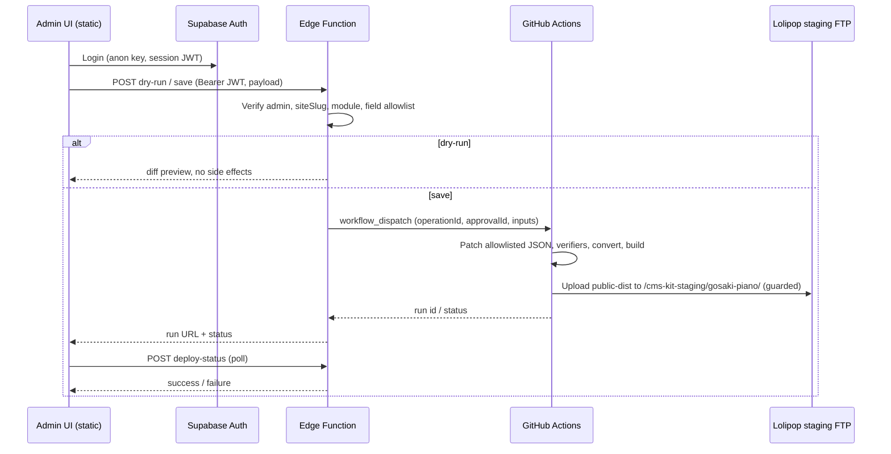

# Gosaki staging online CMS architecture planning (G-11a)

**Phase:** `G-11a-gosaki-staging-online-cms-architecture-planning`  
**Status:** **planning complete** — read-only repo survey + architecture recommendation; **no implementation**  
**Date:** 2026-06-25  
**Prior:** G-10h5-2a staging manual upload post-QA (commit `ffd1496`); G-10i1 About bands images; G-10g Contact HubSpot

| Check | Status |
| --- | --- |
| Existing admin / CMS assets surveyed | **yes** |
| Static hosting constraints documented | **yes** |
| Architecture options A/B/C compared | **yes** |
| Recommended path + PoC + roadmap | **yes** |
| Code / DB / FTP / workflow changes | **no** |

---

## Gates

```txt
gosakiStagingOnlineCmsArchitecturePlanningComplete: true
phase: G-11a
readyForG11bStagingOnlineAdminReadOnlyPage: true
readyForG11cYoutubeUrlWebSaveDryRunPoc: true
readyForWorkflowDispatch: false
readyForAnyFutureFtpApply: false
cursorFtpUploadExecuted: false
cursorDbWriteExecuted: false
```

**Do not:** touch Sariswing production `/admin/`, production Supabase, or `src/pages/admin/` without a future explicit phase.

---

## 1. Goal

Enable **CMS operations from a browser on the Gosaki staging URL**, moving beyond:

```txt
local JSON / config / assets
  → convert → build → manual-upload package
  → Operator FileZilla upload
```

**Target staging site:** `https://yskcreate.weblike.jp/cms-kit-staging/gosaki-piano/`

**Target admin URL (candidate):**

```txt
/cms-kit-staging/gosaki-piano/admin/          ← recommended public-facing alias
/cms-kit-staging/gosaki-piano/__admin/        ← alternate short path
/__admin-staging-shell/musician-basic/        ← existing dev route (long; dev-origin)
```

---

## 2. Current CMS assets (inventory)

### 2.1 Staging admin shell (exists — local / hybrid dev)

| Asset | Location | Notes |
| --- | --- | --- |
| Staging shell routes | `src/pages/__admin-staging-shell/musician-basic/` | Injected via `astro.config.mjs` (`cmsKitAdminShellRoutesIntegration`) |
| Admin UI templates | `tools/static-to-astro/templates/admin-cms/gosaki/` | Gosaki operator pages (Schedule, YouTube, About, Discography) |
| Path constants | `gosaki-staging-admin-paths.ts` | Preview URL → Gosaki staging |
| Auth gate | `AdminGosakiStagingAuthGate.astro` | Supabase Auth (anon key + session in browser) |
| Auth paths | `src/lib/admin/staging-auth/staging-auth-paths.ts` | **Not** production `/admin/` |

**Modules with UI today (staging shell):**

| Module | Route | Write path today |
| --- | --- | --- |
| Schedule | `.../admin/schedule/` | Supabase Edge `admin-schedule` (DB, `service_role` server-side) |
| YouTube | `.../admin/youtube/` | Local JSON via API route **dev only** (G-10c) |
| About | `.../admin/about/` | Local JSON via API route **dev only** (G-10h4) |
| Discography | `.../admin/discography/` | Read-only binding / placeholder |

### 2.2 Local-only write APIs (Node / Astro API routes)

| API | File | `prerender` | Available on static FTP |
| --- | --- | --- | --- |
| YouTube JSON write | `.../api/youtube-embed-static-json-write.json.ts` | `false` | **No** |
| About profile JSON write | `.../api/about-profile-html-static-json-write.json.ts` | `false` | **No** |
| About bands JSON write | `.../api/about-bands-html-static-json-write.json.ts` | `false` | **No** |

`astro.config.mjs` registers these routes **only when `command === "dev"`**. Static `astro build` does not emit server endpoints.

**Executors** (e.g. `gosaki-youtube-embed-static-json-write-executor.ts`) write **local filesystem** under `tools/static-to-astro/config/sites/*.json` with strict guards (`approvalId`, `changedFields`, allowlists).

### 2.3 Static Gosaki public site (staging today)

| Asset | Notes |
| --- | --- |
| Convert hook | `tools/static-to-astro/scripts/` → `output/gosaki-piano-astro` |
| Public package | `output/manual-upload/gosaki-piano/public-dist/` |
| Deploy | Operator FileZilla → `/cms-kit-staging/gosaki-piano/` |
| `static-public` verifier | **Excludes** `admin/`, `api/` from FTP-safe package |
| Completed modules | YouTube embed, About profile/bands HTML, band images, Contact HubSpot, Schedule read (Supabase at build) |

**Important:** Current Gosaki staging package **does not include admin UI**. Admin exists on Sariswing dev server route only.

### 2.4 Supabase (staging CMS project)

| Asset | Location | Role |
| --- | --- | --- |
| Edge `admin-schedule` | `supabase/functions/admin-schedule/` | Schedule CRUD — `service_role` in Edge only |
| Edge `admin-news`, `admin-site-page`, `admin-instagram` | `supabase/functions/admin-*` | Sariswing-oriented modules |
| Edge `trigger-deploy` | `supabase/functions/trigger-deploy/` | Admin JWT → `workflow_dispatch` |
| Edge `deploy-status` | `supabase/functions/deploy-status/` | Poll GitHub Actions run |
| Shared `admin-auth.ts` | JWT + `ADMIN_EMAILS` / `app_metadata.role` | **anon key** validates user; no service_role in browser |
| Shared `github.ts` | `GITHUB_TOKEN` server-side | Never exposed to client |

**Project:** Gosaki schedule uses `static-to-astro-cms-staging` (per G-9k docs). **Not** Sariswing production Supabase.

### 2.5 GitHub Actions / deploy

| Asset | Notes |
| --- | --- |
| `.github/workflows/deploy.yml` | `workflow_dispatch` → `npm run build` → **FTP mirror** to `LOLIPOP_FTP_*` secrets |
| Target today | Sariswing **production** site path (not Gosaki staging subpath) |
| AGENTS.md | `workflow_dispatch` + FTP `--apply` **suspended** after G-7f incident |
| Publish policy scaffold | `publish-workflow-policy.example.json` — staging vs prod separation, secrets server-side |

### 2.6 Production admin (out of scope)

| Asset | Rule |
| --- | --- |
| `src/pages/admin/` | Sariswing production admin — **do not modify** for Gosaki |
| Production Supabase | **do not connect** new Gosaki work |

---

## 3. Web CMS constraints (static FTP / Lolipop)

| Constraint | Implication |
| --- | --- |
| Static HTML/JS only on Lolipop | Admin **UI** can be static; **save** cannot write local repo JSON |
| No Node server | Astro API routes (`*.json.ts`, `prerender=false`) **do not run** on staging host |
| No server filesystem | Browser cannot mutate `tools/static-to-astro/config/sites/*.json` on deploy host |
| Secrets | `GITHUB_TOKEN`, FTP password, `service_role` **must stay server-side** (Edge Function / GitHub Actions secrets) |
| Browser GitHub API | **Forbidden** — use Edge → Actions dispatch |
| Browser direct FTP | **Forbidden** |
| Existing safe package | `public-dist` excludes admin/api — online admin needs **explicit** inclusion strategy in G-11b |

---

## 4. Architecture options A / B / C

### A. Supabase DB save

```txt
Admin UI → Supabase Auth → Edge Function → Supabase DB (schedules, site_embeds, …)
Public site ← build-time SELECT or runtime fetch
```

| Pros | Cons / risks |
| --- | --- |
| Schedule pattern already proven (G-9j5, G-9k) | YouTube / About / Contact today are **static JSON + convert** — migration cost |
| Real-time data possible | Runtime fetch on static host needs client JS or SSR (not current Gosaki model) |
| Fine-grained RLS possible | `service_role` in Edge — must keep strict module/field guards |
| | Build pipeline still needed for static HTML modules unless full runtime CMS |

**Risk:** Split brain — Schedule in DB, About/YouTube in JSON — unless unified schema (`site_embeds`, `site_content_blocks` per G-9a).

### B. GitHub Actions save (static JSON in repo)

```txt
Admin UI → Supabase Auth → Edge Function → workflow_dispatch
GitHub Actions → patch allowlisted JSON → verifiers → convert → build → staging FTP
```

| Pros | Cons / risks |
| --- | --- |
| Matches **current** YouTube / About / Contact architecture | End-to-end latency (minutes) |
| Git audit trail for content JSON | Requires **new** workflow (not production `deploy.yml`) |
| Reuses existing verifiers / convert / manual-upload scripts | `workflow_dispatch` currently **suspended** — needs new approval gate (G-11d+) |
| No DB migration for first PoC | FTP staging deploy still needs G-7f1 hardening + explicit approval |
| Edge already has `trigger-deploy` pattern | Action must not touch production FTP secrets |

**Risk:** Concurrent edits / stale writes — need `operationId`, dry-run, optional optimistic lock on JSON version.

### C. Hybrid (recommended)

| Horizon | Module | Store | Publish |
| --- | --- | --- | --- |
| **Now** | Schedule | Supabase DB (`static-to-astro-cms-staging`) | Existing schedule read at convert; staging admin already wired to Edge |
| **Near (G-11c–f)** | YouTube URL | Static JSON in repo | GitHub Actions pipeline → Gosaki staging FTP |
| **Near** | About HTML blocks | Static JSON in repo | Same pipeline |
| **Later** | Contact HubSpot config | Static JSON (read-only admin first) | Same pipeline |
| **Later** | `site_embeds` / unified CMS | Supabase migration (G-9a deferred) | Build-time or hybrid |

| Pros | Cons / risks |
| --- | --- |
| Lowest risk first PoC (YouTube single field) | Two persistence models to document |
| Reuses 90% of G-10c guards | Schedule saves ≠ JSON saves — different Edge endpoints |
| Phased migration to DB possible | Operators must understand “Save → wait for deploy” for JSON modules |

---

## 5. Recommended architecture

**Primary:** **Option C (Hybrid)** with **Option B pipeline** for static JSON modules.

**Rationale from repo survey:**

1. G-10c / G-10h4 already implemented **field-level guards + dry-run + approvalId** for static JSON — best PoC foundation.
2. `trigger-deploy` + `deploy-status` Edge Functions exist for **server-side** GitHub integration.
3. Schedule should **remain** on Supabase Edge (`admin-schedule`) — do not regress G-9k arc.
4. Gosaki staging public site is **static FTP** — JSON-in-repo + Actions build matches `manual-upload` flow.
5. Production `deploy.yml` must **not** be reused for Gosaki staging — separate workflow + secrets path.

---

## 6. Save flow (target — static JSON module)



**Steps (normative):**

1. Operator opens staging admin UI (static HTML/JS under Gosaki deployBase).
2. Supabase Auth login (email allowlist / role — same model as `admin-auth.ts`).
3. Edit module (e.g. YouTube `videoId` / URL).
4. **Dry-run** request → Edge validates JWT, `siteSlug=gosaki-piano`, module allowlist, field allowlist, returns diff.
5. **Save** request → Edge validates `approvalId` / `operationId`, duplicate guard.
6. Edge calls **new** workflow `gosaki-staging-content-publish.yml` (name TBD) via `workflow_dispatch` — **not** production `deploy.yml`.
7. Action: checkout, apply JSON patch (server-side script reusing G-10c guards), `convert` + `verify` + `manual-upload:package`, staging FTP upload (no `--delete`, path allowlist).
8. Edge returns `runId`; UI polls `deploy-status` or shows Actions URL.
9. Staging site reflects change after FTP completes.

**Schedule module (parallel path):** UI → existing `admin-schedule` Edge → DB write → **separate** “rebuild staging” action or manual convert until unified publish exists.

---

## 7. First web-save PoC candidate

**Recommended:** **YouTube embed URL / `videoId`** (G-11c)

| Criterion | YouTube | Others |
| --- | --- | --- |
| Single-field / small payload | **Yes** | About HTML = large / risky |
| Static JSON path exists | **Yes** (`gosaki-piano-youtube-embed.json`) | Contact HubSpot = allowlist-sensitive |
| Guards + dry-run implemented | **Yes** (G-10c) | Bands images = binary assets |
| End-to-end pipeline test | **Ideal** | Schedule = DB not JSON |

**PoC scope (G-11c):** Edge dry-run only — no `workflow_dispatch`, no FTP.

**PoC scope (G-11d):** Edge dispatch to Actions dry-run job (validate JSON patch in CI, no FTP).

**Defer:** About HTML Save, band image upload, Contact HubSpot config write, Schedule new slices.

---

## 8. Security / safety design

| Control | Requirement |
| --- | --- |
| `siteSlug` allowlist | `gosaki-piano` only |
| Module allowlist | e.g. `youtube-embed`, `about-profile-html`, `about-bands-html` — one module per phase |
| Field allowlist | `changedFields` only (reuse G-10c / G-10h4 guards) |
| Dry-run first | Mandatory before Save in UI |
| `approvalId` / `operationId` | Per-phase registered IDs; no reuse across phases |
| Stale / duplicate guard | `operationId` idempotency; optional JSON `updatedAt` / hash |
| Secrets | `GITHUB_TOKEN`, FTP creds, `service_role` — Edge / Actions secrets only |
| Browser | `PUBLIC_SUPABASE_ANON_KEY` only; JWT in `Authorization` header |
| Supabase project | `static-to-astro-cms-staging` only — **not** Sariswing production |
| Production | No `gosaki-piano.com`, no Sariswing prod FTP, no `src/pages/admin/` changes |
| FTP | No `mirror --delete`; remote path allowlist `/cms-kit-staging/gosaki-piano/`; G-7f1 preflight + explicit approval before any `--apply` |
| Rollback | Git revert commit from Actions; re-run publish workflow; document rollback JSON in phase doc |

---

## 9. G-11 short-term roadmap

| Phase | Focus | Deliverable |
| --- | --- | --- |
| **G-11a** | Architecture planning | This doc — **complete** |
| **G-11b** | Staging online admin **read-only** page | Build admin shell static pages into Gosaki package at `/admin/` (or mapped path); Auth UI; no Save |
| **G-11c** | YouTube URL web-save **dry-run** PoC | New Edge Function: JWT + guards + dry-run response; UI calls Edge not local API |
| **G-11d** | Edge + GitHub Actions **dispatch** PoC | New workflow (dry-run job): validate JSON patch in CI; no FTP |
| **G-11e** | Staging auto-build / package **dry-run** | Workflow runs convert + verifiers + package artifact; no FTP |
| **G-11f** | Staging auto-deploy **guarded execution** | FTP to staging only; operator approval; G-7f1 preflight; no production secrets |

**Optional refinements:**

- **G-11b-1:** Map route `/cms-kit-staging/gosaki-piano/admin/` → shell home (shorter than `__admin-staging-shell/...`).
- **G-11g:** Unify “Publish staging” button for Schedule + JSON modules.
- **G-11h:** `site_embeds` Supabase migration (G-9a deferred).

---

## 10. Open decisions (for G-11b planning)

1. **Admin URL path** on Gosaki staging: `/admin/` vs `/__admin/` vs full `__admin-staging-shell/...` with deployBase.
2. **Include admin in `public-dist`** vs separate admin package upload — security/noindex implications.
3. **New GitHub workflow name** and secret set (`GOSAKI_STAGING_FTP_*` vs reuse with path override).
4. **Whether JSON Save auto-commits to `main`** or uses a bot branch + PR (safer review).

---

## 11. What was not done (G-11a)

- Code implementation
- Edge Function creation / deployment
- GitHub Actions creation / modification
- `workflow_dispatch` execution
- DB / Supabase writes / migrations
- FTP / FileZilla / upload
- `src/pages/admin` changes
- Image file operations

---

## 12. References

- [admin-runtime-integration-plan.md](./admin-runtime-integration-plan.md)
- [gosaki-youtube-embed-read-and-write-planning.md](./gosaki-youtube-embed-read-and-write-planning.md) (G-10b)
- [gosaki-cms-scope-and-schedule-youtube-planning.md](./gosaki-cms-scope-and-schedule-youtube-planning.md) (G-9a)
- [gosaki-staging-manual-upload-post-qa-finalization.md](./gosaki-staging-manual-upload-post-qa-finalization.md) (G-10h5-2a)
- [ftp-deploy-root-delete-incident-and-safety-hardening.md](./ftp-deploy-root-delete-incident-and-safety-hardening.md) (G-7f1)
- `supabase/functions/trigger-deploy/`, `supabase/functions/_shared/admin-auth.ts`
- `astro.config.mjs` — dev-only API routes
- `tools/static-to-astro/scripts/lib/static-public-artifact-verifier.mjs` — admin excluded from FTP package
