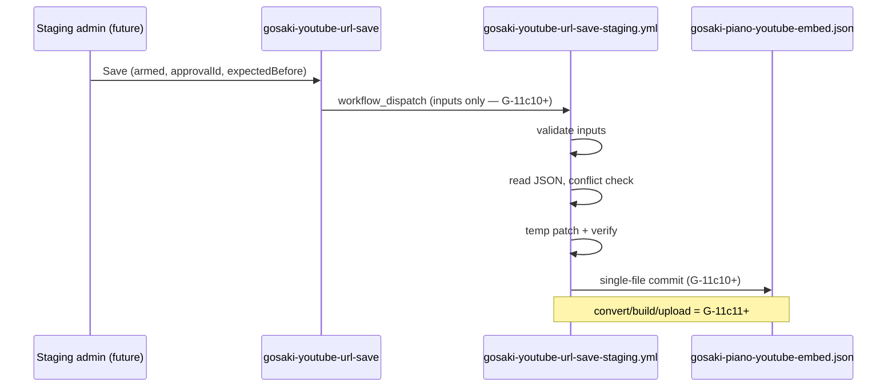

# G-11c7 — Gosaki YouTube URL save workflow JSON patch planning

**Phase:** `G-11c7-gosaki-youtube-url-save-workflow-json-patch-planning`  
**Status:** **planning complete** — patch target, validation, conflict/rollback, commit strategy, phase gates documented; **no workflow_dispatch / JSON write**  
**Date:** 2026-06-25  
**Prior:** G-11c6d smoke + admin wiring (commit `747b638`); G-11c6c save Edge deploy live

| Check | Status |
| --- | --- |
| Patch target JSON identified | **yes** |
| Field allowlist recommended | **yes** |
| Validation / conflict / rollback designed | **yes** |
| Public reflection deferred | **yes** |
| `workflow_dispatch` executed | **no** |

---

## Gates

```txt
gosakiYoutubeUrlSaveWorkflowJsonPatchPlanningComplete: true
phase: G-11c7
readyForG11c8WorkflowJsonPatchImplementation: true
workflowDispatchExecuted: false
cursorJsonWriteExecuted: false
cursorDbWriteExecuted: false
cursorFtpUploadExecuted: false
supabaseFunctionsDeployExecuted: false
supabaseSecretsSetExecuted: false
```

---

## 1. Background

G-11c6 arc delivered:

```txt
Edge save function (staging live) → admin wiring (Save disabled) → smoke 401
```

Next kit-shaped step:

```txt
web save (future) → workflow_dispatch → static JSON patch → (later) convert/build/upload
```

This doc plans the **workflow JSON patch** slice only. YouTube is the first module; the pattern should generalize to About HTML, Contact config, etc.

---

## 2. Patch target JSON

| Item | Value |
| --- | --- |
| **Path** | `tools/static-to-astro/config/sites/gosaki-piano-youtube-embed.json` |
| `siteSlug` (file root) | `gosaki-piano` |
| Target item `id` | `yt-placeholder-01` (`G10C_YOUTUBE_EMBED_TARGET_ITEM_ID`) |
| Current shape (2026-06-25) | `id`, `published`, `sortOrder`, `embedCode` — **no** `videoId` / `updatedAt` keys |

**Do not patch:** `sectionTitle`, `sortOrder`, other items, other site configs, `src/pages/admin`, production Supabase.

---

## 3. Patch field options (G-11c7 recommendation)

| Option | Fields written | Assessment |
| --- | --- | --- |
| **A** | `embedCode` + `videoId` | `videoId` not in JSON today — adds schema drift |
| **B** | `embedCode` + `videoId` + `published` | Broadens blast radius; URL-save slice should not toggle publish |
| **C** | **`embedCode` only** | **Recommended for G-11c8** — matches URL-save intent; `published` unchanged |

### G-11c7 decision

**Adopt Option C (write `embedCode` only).**

| Field | Workflow write | Notes |
| --- | --- | --- |
| `embedCode` | **yes** | Store normalized YouTube URL / watch URL (same as G-11c1 / G-10c) |
| `videoId` | **no** (derived) | Extract for validation + optimistic lock compare only |
| `published` | **no** | Keep existing `true`; URL change must not unpublish |
| `updatedAt` | **no** (G-11c8) | Not in schema; audit via git commit metadata + `requestId` |

`videoId` optimistic lock uses **derived** value from current `embedCode` vs input URL — same logic as `gosaki-youtube-url-save.ts` / G-11c1.

---

## 4. End-to-end flow (target)



**G-11c7 scope:** design only — no dispatch, no commit.

---

## 5. `workflow_dispatch` inputs (planned)

| Input | Required | Purpose |
| --- | --- | --- |
| `site_slug` | yes | Allowlist `gosaki-piano` |
| `module` | yes | Allowlist `youtube-embed` |
| `item_id` | yes | Allowlist `yt-placeholder-01` |
| `youtube_url` | yes | Next URL / embedCode source (normalize) |
| `expected_before_embed_code` | yes | Optimistic lock |
| `expected_before_video_id` | yes | Derived lock (11-char id) |
| `approval_id` | yes | `G-11c6-gosaki-youtube-url-web-save-non-dry-run-slice` |
| `operation_id` | yes | `G-11c6-gosaki-youtube-url-web-save-non-dry-run-slice` |
| `request_id` | yes | UUID / opaque id for audit (no PII) |
| `actor_id_hash` | optional | SHA-256 of Supabase user id — **not** email |

**Never log / store in workflow output:** raw email, JWT, `GITHUB_TOKEN`, Supabase secrets, full `youtube_url` in error banners (use `request_id` + field names only).

---

## 6. Workflow-side validation (normative)

| # | Rule | On failure |
| --- | --- | --- |
| 1 | `site_slug === gosaki-piano` | fail job |
| 2 | `module === youtube-embed` | fail job |
| 3 | `item_id === yt-placeholder-01` | fail job |
| 4 | `approval_id` / `operation_id` match G-11c6 constants | fail job |
| 5 | `youtube_url` passes G-11c1 forbidden-pattern + videoId parse | fail job |
| 6 | Read allowlisted JSON path only | fail job |
| 7 | JSON parse + schema shape (`items[]`, target item exists) | fail job |
| 8 | `expected_before_*` matches live item (embed + derived videoId) | **conflict** — fail job, no commit |
| 9 | Derived `next` equals current → **no_change** — exit 0, no commit | success skip |
| 10 | Patch **only** `items[].embedCode` for target id | fail if other keys touched |
| 11 | Do not modify `published`, `sortOrder`, `sectionTitle`, `$comment` | fail job |
| 12 | Post-patch: run `verify-g11c8-*` or G-10c guard script (G-11c8 impl) | fail job, no commit |
| 13 | Secrets / tokens never echoed | policy |

Reuse: `parseYoutubeVideoId` / guards from `gosaki-youtube-url-dry-run.ts`, G-10c `assertG10cYoutubeEmbed*` patterns (ported to `tools/static-to-astro/scripts/lib/` for CI).

---

## 7. Conflict / rollback

| Scenario | Behavior |
| --- | --- |
| `expected_before` mismatch | Job **failure**; JSON untouched |
| Validation error before write | No file change |
| Verify fails after temp write | Discard temp; no commit |
| Success commit | Single-file diff only |

### Write sequence (G-11c8 implementation)

```txt
read JSON → validate → conflict check → no_change early exit
→ write tools/static-to-astro/output/patch-work/gosaki-youtube-embed.json (temp)
→ run verifier on temp
→ atomic replace allowlisted path OR git commit from clean tree
→ if any step fails: abort, no commit
```

### Rollback

| Method | When |
| --- | --- |
| `git revert <commit>` | Preferred — operator or workflow bot identity |
| Manual restore from last known good | If revert unclear |
| Re-dispatch with previous URL | Forward fix (new approval + request_id) |

**Never:** manual edit without `request_id` / approval audit trail in staging phases.

---

## 8. Commit / branch strategy

| Strategy | Pros | Cons | G-11c7 |
| --- | --- | --- | --- |
| Direct commit to `main` | Fast; matches G-10c local write → repo truth | Higher risk if guards weak | **Recommended for G-11c10** with strict path allowlist |
| Staging branch + PR | Reviewable | Slower; bot PR tooling | Defer unless operator requests |
| Staging branch direct commit | Isolates experiments | Extra merge step | Optional later |

### Recommended commit policy

- **Branch:** `main` (single-file commit) for G-11c10 first dispatch
- **Commit message template:**

```txt
cms-kit(gosaki-youtube): patch embedCode [request_id=<id>] [approval=<approval_id>]
```

- **Actor:** `github-actions[bot]` or dedicated machine user — document in G-11c9 preflight
- **Paths allowlist in workflow:** only `tools/static-to-astro/config/sites/gosaki-piano-youtube-embed.json`

---

## 9. Public reflection (deferred)

| Phase | Scope |
| --- | --- |
| **G-11c8** | Workflow JSON patch **implementation** — dispatch **not** executed |
| **G-11c9** | Dispatch preflight + rollback doc |
| **G-11c10** | One `workflow_dispatch` (operator approval) |
| **G-11c11** | Post-dispatch verification + **public reflection planning** |

| Step | Phase |
| --- | --- |
| JSON patch | G-11c8–G-11c10 |
| `convert` / `build` | G-11c11+ |
| `manual-upload:package` | G-11c11+ |
| FTP / Lolipop upload | **Separate** — G-7f1 gates; not in G-11c7–c10 |

---

## 10. Edge → workflow dispatch bridge (future — not G-11c7)

When `GOSAKI_YOUTUBE_URL_SAVE_ARMED=true` and dispatch implemented (post G-11c8):

| Edge action | Inputs mapped to workflow |
| --- | --- |
| After save validation | `youtube_url`, `expected_before_*`, `request_id`, hashes |

**G-11c7:** document only — `workflowDispatchExecuted: false` in Edge remains until G-11c8+.

**Secrets (names only — not set in G-11c7):**

| Name | Use |
| --- | --- |
| `GOSAKI_STAGING_CONTENT_PUBLISH_TOKEN` | GitHub PAT for `workflow_dispatch` from Edge |
| `GITHUB_REPO` | Already used by `trigger-deploy` pattern |

**Staging ref only:** `kmjqppxjdnwwrtaeqjta` — never `vsbvndwuajjhnzpohghh`.

---

## 11. Phase gates (execution)

| Phase | Scope | Dispatch | JSON write |
| --- | --- | --- | --- |
| **G-11c7** | Planning | **no** | **no** |
| **G-11c8** | Workflow patch implementation | **no** | **no** |
| **G-11c9** | Dispatch preflight | **no** | **no** |
| **G-11c10** | Operator-approved dispatch ×1 | **yes** | **yes** (via workflow) |
| **G-11c11** | Post-dispatch + public reflection plan | — | — |

---

## 12. Safety — G-11c7 phase

| Item | Status |
| --- | --- |
| `workflow_dispatch` | **not executed** |
| Workflow implementation change | **not in G-11c7** (planning only) |
| JSON file mutation | **not executed** |
| Save / `saveEnabled:true` | **not executed** |
| DB write | **not executed** |
| FTP / upload | **not executed** |
| `supabase functions deploy` | **not executed** |
| `supabase secrets set` | **not executed** |
| `src/pages/admin` | **unchanged** |
| Production ref operation | **not executed** |

---

## 13. Local verification

```bash
node tools/static-to-astro/scripts/verify-g11c7-gosaki-youtube-url-save-workflow-json-patch-planning.mjs
```

---

## References

- G-11c6d: `gosaki-youtube-url-save-endpoint-smoke-and-admin-wiring-check.md`
- G-11c6a: `gosaki-youtube-url-web-save-non-dry-run-slice-implementation.md`
- G-11c5: `gosaki-youtube-url-web-save-non-dry-run-slice-planning.md`
- G-10c: `gosaki-youtube-embed-static-json-write-slice-implementation.md`
- `.github/workflows/gosaki-youtube-url-save-staging.yml`
- `tools/static-to-astro/config/sites/gosaki-piano-youtube-embed.json`
