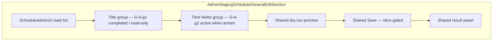

# Schedule general edit next slice planning (G-6-g2)

Last updated: 2026-06-14  
Phase: `G-6-g2-schedule-general-edit-next-slice-planning`  
Type: **planning only** — no DB write, no Supabase SQL, no Run click, no Save execution, no implementation

## Purpose

After successful G-6-g1 title non-dry-run execution (`cce3f97`), decide which Schedule general edit slice to implement next on the staging shell product path — without touching PoCs, production, or `/admin`.

**This phase performed:** code/docs read, risk comparison, planning doc, AI context updates.  
**This phase did not:** UPDATE / INSERT / DELETE, Supabase SQL, non-dry-run Save, Run/Save click, implementation, `/admin` changes, `service_role`.

## Prerequisites (completed)

| Phase | Outcome |
| --- | --- |
| G-6-g1 execution | title slice succeeded; optimistic lock + `updated_at` trigger verified |
| G-6-f6 | venue + description PoC succeeded (frozen) |
| G-6-f8 | `schedules_set_updated_at` trigger active on staging |
| G-6-f10 | `executeScheduleGeneralUpdateWrite` + optimistic lock wired |

```txt
scheduleTitleNonDryRunSliceExecutionSucceeded: true
nonDryRunSaveExecuted: true
optimisticLockWiredInProductPath: true
rollbackNeeded: false
```

---

## 1. G-6-g1 outcome (baseline for G-6-g2)

| Item | Value |
| --- | --- |
| Target row | `aa440e29-5be8-402e-9190-0d81c48434c0` (`schedule-2026-07-010`) |
| changedFields | `["title"]` only |
| title | `<>` → `[CMS Kit staging] G-6-g1 title PoC` |
| venue / description | G-6-f6 values unchanged |
| `updated_at` after Save | `2026-06-14T15:03:08.762993+00` |
| Approval ID | `G-6-g1-schedule-title-non-dry-run-slice` — **frozen; do not reuse** |
| Env arm | `PUBLIC_ADMIN_SCHEDULE_G6G1_TITLE_NON_DRY_RUN_ARMED` — **frozen** |
| Write path | `executeG6G1TitleNonDryRunSave` → `executeScheduleGeneralUpdateWrite` |
| Cursor Save/Run/SQL | none |

Doc: [schedule-title-non-dry-run-slice-execution-result.md](./schedule-title-non-dry-run-slice-execution-result.md)

---

## 2. Next slice candidates — comparison

Scoring: **Low** = safer for next non-dry-run; **High** = defer.

| # | Candidate | Change risk | UI value | Test row fit | Rollback ease | schedule_months | Visibility impact | Lock test value | UI extension |
| --- | --- | --- | --- | --- | --- | --- | --- | --- | --- |
| 1 | **open_time + start_time** | **Low** — null→text; no routing | Medium-high | **Excellent** (both null) | **Easy** (null restore) | None | None (`show_on_home: false`) | High | **Easy** — 2 inputs, same section |
| 2 | **price** | **Low** — null→text | Medium | **Excellent** (null) | **Easy** (null restore) | None | None | High | Easy — 1 input |
| 3 | venue + description (general UI) | Low write (G-6-f6 proved) but **semantic overlap** with frozen PoC markers | High | Good — values already set | Easy strings | None | Low | High | Medium — must not reuse G-6-f6 approval |
| 4 | published / show_on_home | **Medium-high** — site visibility | High | OK (`published: true`) | Medium — booleans | None | **High** | High | Extra confirm layer |
| 5 | sort_order / home_order | Medium — list ordering | Medium | OK (`sort_order: 10`) | Easy numbers | None | Low-medium | High | Number inputs |
| 6 | date | **High** — routing / month grouping | High | Risky — tied to `legacy_id` / source routes | Harder | **Indirect** via build | Medium | High | Complex validation |
| 7 | image_url / home_image_url | **High** — Storage CMS dependency | Medium | null OK | URL strings | None | Low | Medium | Blocked on Storage |
| 8 | create (INSERT) | **High** — new RLS/grant scope | N/A | N/A | DELETE rollback | N/A | N/A | N/A | New flow |
| 9 | logical delete / restore | **High** | N/A | N/A | Complex | N/A | **High** | N/A | Cross-module |

### 2.1 Notes per candidate

**open_time + start_time**

- Target row has `open_time: null`, `start_time: null` — clean before/after.
- Often edited together; one slice = one approval = one Save matches G-6-g discipline.
- No impact on `schedule_months`, routing, or home visibility.
- Rollback: `SET open_time = NULL, start_time = NULL`.

**price**

- Equally low risk; could be G-6-g3 immediately after time fields.
- Combining with time fields in one slice is possible but **not recommended** — violates one-slice-one-approval audit trail and makes rollback/afterVerification noisier.

**venue + description (general UI)**

- G-6-f6 already wrote these fields via PoC path with approval `G-6-f6-schedule-safe-fields-non-dry-run-poc`.
- Product path needs **new** approval ID (`G-6-g4` in original G-6-g map).
- beforeSnapshot validation must expect G-6-f6 marker strings — higher documentation burden than null fields.
- Defer to **G-6-g4** after more product-path slices prove the pattern.

**published / show_on_home**

- `published: true` on test row — flipping could affect staging site rendering.
- Requires extra confirmation UX (planned in G-6-g5).

**date**

- Changes can affect month buckets and static route generation — late slice per G-6-f7.

---

## 3. Recommended next slice

### Decision

```txt
Recommended implementation slice: G-6-g2-schedule-time-fields-non-dry-run-slice
Fields: open_time, start_time only
Approval ID: G-6-g2-schedule-time-fields-non-dry-run-slice
Env arm: PUBLIC_ADMIN_SCHEDULE_G6G2_TIME_FIELDS_NON_DRY_RUN_ARMED=true
```

### Rationale

1. **Agreed order** — [schedule-general-edit-ui-planning.md](./schedule-general-edit-ui-planning.md) §9 and G-6-f7 field order: title (done) → time fields → price.
2. **Lowest remaining risk** — pure nullable text; no visibility, routing, or `schedule_months` coupling.
3. **Test row affinity** — same proven row; both fields null; `show_on_home: false` limits public blast radius.
4. **Rollback simplicity** — restore nulls in one UPDATE.
5. **Optimistic lock** — second product-path proof with new baseline `updated_at` from G-6-g1.
6. **UI extension** — add two fields to existing `AdminStagingScheduleGeneralEditSection` without slice selector complexity.
7. **price deferred to G-6-g3** — equally safe but separate slice preserves one-approval-one-Save discipline.

### Not recommended as G-6-g2

| Alternative | Why defer |
| --- | --- |
| Combined safe-text (`open_time` + `start_time` + `price`) | Multi-field slice blurs changedFields audit; harder rollback story |
| venue + description general UI | PoC overlap; needs G-6-g4 namespace; not next in order |
| published / visibility | Medium-high risk on `published: true` row |

---

## 4. Target row policy

### Recommendation: **reuse same row**

```txt
id: aa440e29-5be8-402e-9190-0d81c48434c0
legacy_id: schedule-2026-07-010
date: 2026-07-19
title: [CMS Kit staging] G-6-g1 title PoC          ← expect G-6-g1 post-state
venue: [CMS Kit staging] G-6-f6 venue PoC          ← unchanged
description: 出演： [G-6-e5 non-dry-run PoC] [G-6-f6 safe-fields staging test]
open_time: null                                    ← G-6-g2 write target
start_time: null                                    ← G-6-g2 write target
price: null                                         ← leave for G-6-g3
published: true
show_on_home: false
sort_order: 10
updated_at: 2026-06-14T15:03:08.762993+00          ← optimistic lock baseline
```

| Approach | G-6-g2 | Later |
| --- | --- | --- |
| **Reuse G-6-g1 row** | **Recommended** | Default for next 2–3 slices |
| New row from picker | Defer | General product behavior after g4+ |
| `PUBLIC_ADMIN_SCHEDULE_SLICE_TARGET_ID` | Optional lock for first execution | Same env as G-6-g1 |

**Why reuse**

- Continuous audit trail on one staging test fixture (G-6-e5 → G-6-f6 → G-6-g1 → G-6-g2).
- Null time fields ready for first write.
- `show_on_home: false` — time edits unlikely to affect home page.

**beforeSnapshot validation updates (implementation phase)**

- Expect `title` = G-6-g1 post-value (not `<>`).
- Expect `open_time` / `start_time` = `null` before execution.
- Expect venue / description = G-6-f6 markers (unchanged).
- `validateG6G1TitleBeforeSnapshot` still expects `title: <>` — **do not re-arm G-6-g1**; add `validateG6G2TimeFieldsBeforeSnapshot` in implementation.

---

## 5. Approval ID policy

### Frozen (never reuse)

```txt
G-6-e5-schedule-non-dry-run-poc
G-6-f6-schedule-safe-fields-non-dry-run-poc
G-6-g1-schedule-title-non-dry-run-slice
```

### G-6-g2 (next slice)

| Purpose | ID |
| --- | --- |
| Non-dry-run execution | `G-6-g2-schedule-time-fields-non-dry-run-slice` |
| Dry-run preview (optional) | `G-6-g2-schedule-time-fields-dry-run-preview` |

Register in `schedule-write-types.ts` + `SCHEDULE_WRITE_APPROVAL_IDS` at **implementation** phase only.

### Future slices (reference — not G-6-g2 scope)

| Phase | Approval ID | Fields |
| --- | --- | --- |
| G-6-g3 | `G-6-g3-schedule-price-non-dry-run-slice` | `price` |
| G-6-g4 | `G-6-g4-schedule-venue-description-non-dry-run-slice` | `venue`, `description` |
| G-6-g5 | `G-6-g5-schedule-visibility-non-dry-run-slice` | `published`, `show_on_home` |
| G-6-g6 | `G-6-g6-schedule-ordering-non-dry-run-slice` | `sort_order`, `home_order` |
| G-6-g7 | `G-6-g7-schedule-date-non-dry-run-slice` | `date` |

---

## 6. Env gate policy

### Frozen (G-6-g1 — do not re-arm)

```txt
PUBLIC_ADMIN_SCHEDULE_G6G1_TITLE_NON_DRY_RUN_ARMED=true
PUBLIC_ADMIN_WRITE_APPROVAL_ID=G-6-g1-schedule-title-non-dry-run-slice
```

### G-6-g2 arm stack (template — preflight doc will finalize)

```bash
ENABLE_ADMIN_STAGING_SHELL=true
ENABLE_ADMIN_STAGING_DATA_READ=true
PUBLIC_ADMIN_DATA_PROVIDER=supabase
ENABLE_ADMIN_STAGING_WRITE=true
PUBLIC_ADMIN_WRITE_PROVIDER=supabase
PUBLIC_ADMIN_WRITE_MODULE=schedule
PUBLIC_ADMIN_WRITE_APPROVAL_ID=G-6-g2-schedule-time-fields-non-dry-run-slice
PUBLIC_ADMIN_WRITE_DRY_RUN=false
PUBLIC_ADMIN_SCHEDULE_OPTIMISTIC_LOCK=true
PUBLIC_ADMIN_SCHEDULE_G6G2_TIME_FIELDS_NON_DRY_RUN_ARMED=true
# Optional first execution:
PUBLIC_ADMIN_SCHEDULE_SLICE_TARGET_ID=aa440e29-5be8-402e-9190-0d81c48434c0
```

| Env | Purpose |
| --- | --- |
| `PUBLIC_ADMIN_SCHEDULE_G6G2_TIME_FIELDS_NON_DRY_RUN_ARMED` | Slice-specific arm — default **off** |
| `PUBLIC_ADMIN_WRITE_APPROVAL_ID` | Must match G-6-g2 approval ID |
| `PUBLIC_ADMIN_SCHEDULE_SLICE_TARGET_ID` | Optional single-row lock |
| `PUBLIC_ADMIN_SCHEDULE_OPTIMISTIC_LOCK` | `true` (default) |

**Routine dev (unchanged)**

```bash
PUBLIC_ADMIN_WRITE_DRY_RUN=true
PUBLIC_ADMIN_SCHEDULE_OPTIMISTIC_LOCK=true
```

---

## 7. UI extension policy

### Current state

- `AdminStagingScheduleGeneralEditSection` — title slice only (G-6-g1).
- `staging-schedule-general-edit-ui.ts` — title field, dry-run preview, gated Save.
- Config: `schedule-general-edit-config.ts` — G-6-g1-specific today.

### G-6-g2 recommendation

| Topic | Decision |
| --- | --- |
| Section layout | **Extend same section** — add “Time fields (G-6-g2)” field group below title |
| Title slice UI | Keep visible as **read-only context** (current DB title); disable title Save when G-6-g2 armed |
| Slice selector | **Defer** — not needed until 4+ active slices |
| Separate sections per slice | **No** — one product section, multiple field groups |
| Dry-run / Save result panel | **Reuse** — parameterize by active slice / changedFields |
| Stale / reload UX | **Reuse** `runDryRunStaleCheck` + reload button |
| Approval ID confirm input | **Slice-specific** label when G-6-g2 armed |
| Config module | Add G-6-g2 constants; evolve toward `getScheduleGeneralEditSliceConfig(slice)` in implementation |

### Save enablement (design)

Only one slice armed at a time:

```txt
if G6G2_TIME_FIELDS_ARMED:
  enable open_time + start_time inputs + G-6-g2 Save
  disable G-6-g1 title Save (even if title fields visible)
```

### mermaid — section evolution



---

## 8. Guard policy

### Recommendation: **slice-specific guard** (G-6-g1 pattern)

Add at implementation time:

```typescript
assertG6G2TimeFieldsPayloadOnly(payload)
// allowed keys: open_time, start_time only
// both keys required (same pattern as assertG6F6SafeFieldsPayloadOnly)
```

| Approach | G-6-g2 | Later |
| --- | --- | --- |
| `assertG6G2TimeFieldsPayloadOnly` | **Yes** | Per-slice audit |
| `assertG6G3PricePayloadOnly` | — | G-6-g3 |
| `assertScheduleSafeTextPayloadOnly` | **Defer** | Optional refactor after g3 if 3+ text slices share rules |

**Why not shared guard yet**

- Each slice needs distinct approval ID + changedFields proof.
- Shared guard risks accidental multi-field payloads across slices.
- G-6-f6 and G-6-g1 slice-specific guards proved the pattern.

**Trigger module (implementation)**

- `schedule-g6g2-time-fields-non-dry-run-trigger.ts`
- `executeG6G2TimeFieldsNonDryRunSave` → `executeScheduleGeneralUpdateWrite`
- `validateG6G2TimeFieldsBeforeSnapshot` — expects G-6-g1 title + G-6-f6 venue/description + null times

---

## 9. Proposed payload and rollback

### Payload (staging markers)

```json
{
  "open_time": "[CMS Kit staging] G-6-g2 open PoC",
  "start_time": "[CMS Kit staging] G-6-g2 start PoC"
}
```

Alternative: realistic times (`"18:00"`, `"18:30"`) — preflight may choose either; markers preferred for SQL verification clarity (consistent with G-6-f6 / G-6-g1).

### Rollback SQL (staging only — not executed in planning)

```sql
-- G-6-g2 rollback — execute only if explicitly approved
update public.schedules
set open_time = null,
    start_time = null
where id = 'aa440e29-5be8-402e-9190-0d81c48434c0';
```

Note: rollback UPDATE advances `updated_at` via trigger — acceptable for staging restore.

### afterVerification SQL (template)

```sql
select
  id,
  legacy_id,
  open_time,
  start_time,
  title,
  venue,
  description,
  date,
  published,
  show_on_home,
  sort_order,
  created_at,
  updated_at,
  (open_time = '[CMS Kit staging] G-6-g2 open PoC') as open_time_match,
  (start_time = '[CMS Kit staging] G-6-g2 start PoC') as start_time_match,
  (title = '[CMS Kit staging] G-6-g1 title PoC') as title_unchanged,
  (venue = '[CMS Kit staging] G-6-f6 venue PoC') as venue_unchanged,
  (description = '出演： [G-6-e5 non-dry-run PoC] [G-6-f6 safe-fields staging test]') as description_unchanged,
  (date = '2026-07-19') as date_unchanged,
  (published is true) as published_unchanged,
  (show_on_home is false) as show_on_home_unchanged,
  (sort_order = 10) as sort_order_unchanged
from public.schedules
where id = 'aa440e29-5be8-402e-9190-0d81c48434c0';
```

### afterVerification checklist

```txt
row count: 1
open_time_match: true
start_time_match: true
title_unchanged: true
venue_unchanged: true
description_unchanged: true
date_unchanged: true
published_unchanged: true
show_on_home_unchanged: true
sort_order_unchanged: true
created_at unchanged
updated_at advanced
changedFields: ["open_time", "start_time"] only
optimistic lock: expectedBeforeUpdatedAt matched 2026-06-14T15:03:08.762993+00
no optimistic_lock_failed
schedule_months untouched
rollbackNeeded: false (unless team chooses restore)
```

---

## 10. Phase breakdown (G-6-g2 time fields)

Same discipline as G-6-g1:

| # | Phase | DB write | Cursor Save/Run |
| --- | --- | --- | --- |
| 1 | `G-6-g2-schedule-general-edit-next-slice-planning` | No | No — **this doc** |
| 2 | `G-6-g2-schedule-time-fields-non-dry-run-slice-preflight` | No | No |
| 3 | `G-6-g2-schedule-time-fields-non-dry-run-slice-implementation` | No | No |
| 4 | `G-6-g2-schedule-time-fields-non-dry-run-slice-final-preflight` | No | No |
| 5 | `G-6-g2-schedule-time-fields-non-dry-run-slice-execution` | Yes (user manual Save once) | No |
| 6 | execution result commit | No | No |

**Recommended next phase after this planning:**

```txt
G-6-g2-schedule-time-fields-non-dry-run-slice-preflight
```

---

## 11. Implementation file plan (reference — not this phase)

| File | Action |
| --- | --- |
| `schedule-write-types.ts` | Add G-6-g2 approval ID |
| `schedule-write-guards.ts` | Add `assertG6G2TimeFieldsPayloadOnly` |
| `schedule-g6g2-time-fields-non-dry-run-trigger.ts` | New trigger |
| `schedule-time-fields-dry-run.ts` | Dry-run builder (mirror `schedule-title-dry-run.ts`) |
| `schedule-general-edit-config.ts` | Extend or add G-6-g2 gate constants |
| `staging-schedule-general-edit-ui.ts` | Time inputs + G-6-g2 save handler |
| `AdminStagingScheduleGeneralEditSection.astro` | Time field group markup |

**Do not modify:** G-6-e5 / G-6-f6 PoC triggers, `/admin`, `schedule_months` writes.

---

## 12. Gate decision

```txt
scheduleGeneralEditNextSlicePlanningComplete: true
recommendedNextSlice: G-6-g2-schedule-time-fields-non-dry-run-slice
readyForG6G2ScheduleTimeFieldsNonDryRunSlicePreflight: true
scheduleTitleNonDryRunSliceExecutionSucceeded: true
nonDryRunSaveExecuted: true
rollbackNeeded: false
optimisticLockWiredInProductPath: true
nonDryRunSaveUiExposed: true
dbWriteInLatestPhase: false
```

---

## 13. G-6-g2 planning safety statement

```txt
DB write: none
Supabase SQL executed: none
Run button click: none
Save button click: none
G-6-g1 Save re-execution: none
G-6-e5 / G-6-f6 PoC re-click: none
/admin: not modified
schedule_months: read-only / derived (not touched)
service_role: not used
production: not touched
```

## Related docs

- [schedule-general-edit-ui-planning.md](./schedule-general-edit-ui-planning.md)
- [schedule-title-non-dry-run-slice-execution-result.md](./schedule-title-non-dry-run-slice-execution-result.md)
- [schedule-write-hardening-and-updated-at-planning.md](./schedule-write-hardening-and-updated-at-planning.md)
- [schedule-optimistic-lock-enablement-implementation.md](./schedule-optimistic-lock-enablement-implementation.md)
